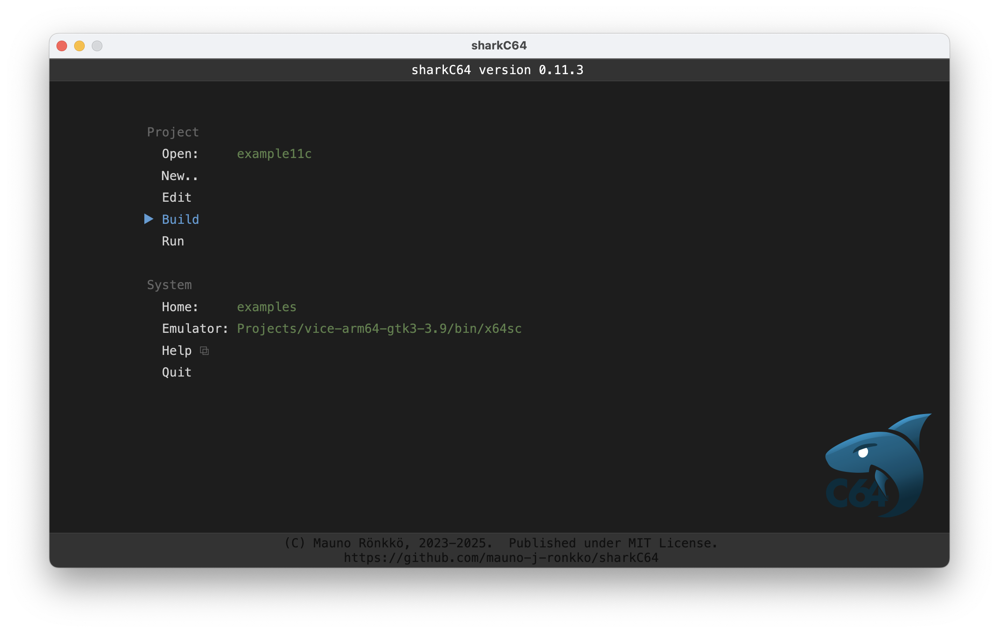

# Building the active module

The home screen of the sharkC64 IDE looks as follows:

To build the active module, click the Build action in the Module section.
It will first compile the module and then write the executable prg file.

If errors are found during the compilation, the editor view will be opened
and the first error location will be displayed. For more about the
editor view, see the documentation about [editing](editing.md).

If the build is successful, the comment next to the selected module
will state "build ok" instead of "build missing" as in the picture above.

  
:leftwards_arrow_with_hook: [Back to index](../index.md)

