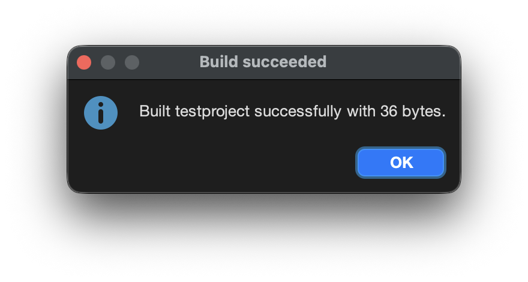
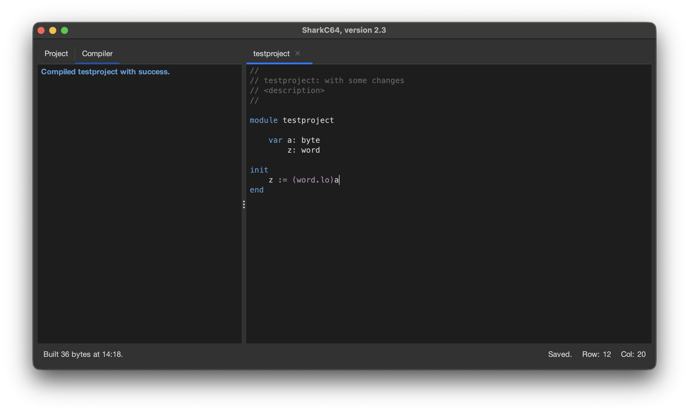

# Building a project

You can build a project from the Compiler menu.

To generate an executable bytecode file (.prg), select the "Build Project" item.
It compiles the project and, if successful, save the resulting bytecode into an executable file.

If there are errors in the project, the Compiler tab shows the errors as a list.
You can locate the error in the source code by clicking it in the Compiler tab.

After correcting all the errors, the "Build Project" item can be reselected. 
If the build is successful, a message dialog confirms it.

The Compiler tab shows a successful compilation success, 
and the status bar for the Compiler tab indicates that the project was "Built".

The generated executable file (.prg) is then saved to the home directory of the project.

  
:leftwards_arrow_with_hook: [Back to index](../../index.md)

