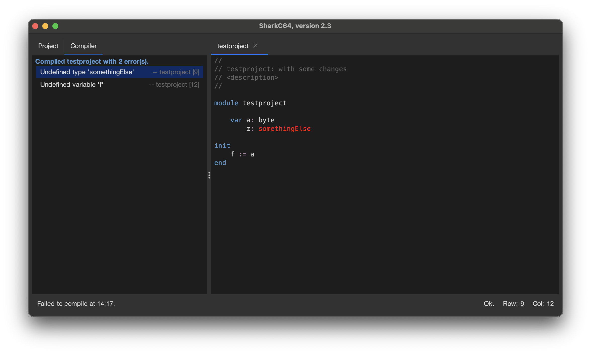
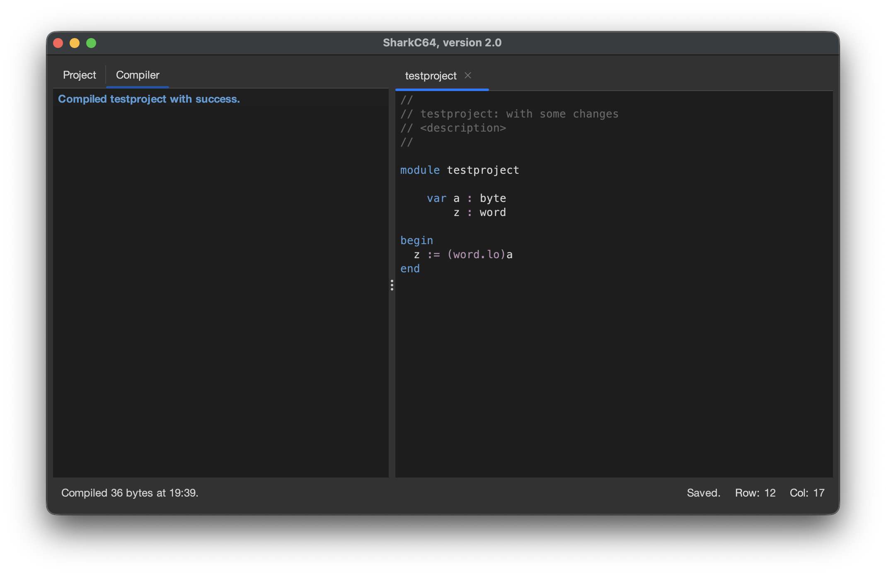

# Compiling a module 

You can compile a module from the Compiler menu.

To create the active module in the editor view, select the "Compile Module" item.
It compiles the module along with all the modules it uses,
and shows the compilation result in the Compiler tab.

For instance, if the module has errors, the Compiler tab shows the errors as a list.
You can locate the error in the source code by clicking it in the Compiler tab.

After correcting all the errors, the Compiler tab shows a successful compilation result.

It should be noted that the compilation does create any executable program.
It merely compiles the active module to check, if it contains any errors.
Also, the compilation does not compile the entire project - unless the module is the main module.

  
:leftwards_arrow_with_hook: [Back to index](../../index.md)

