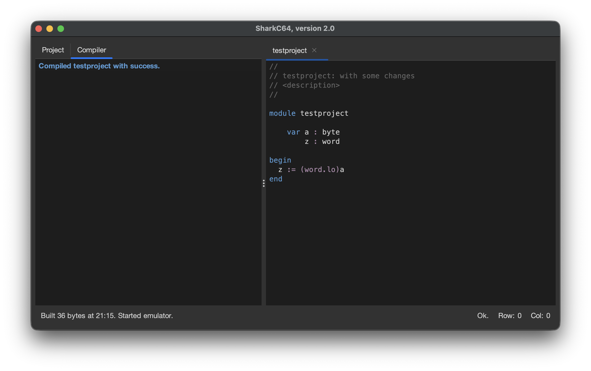
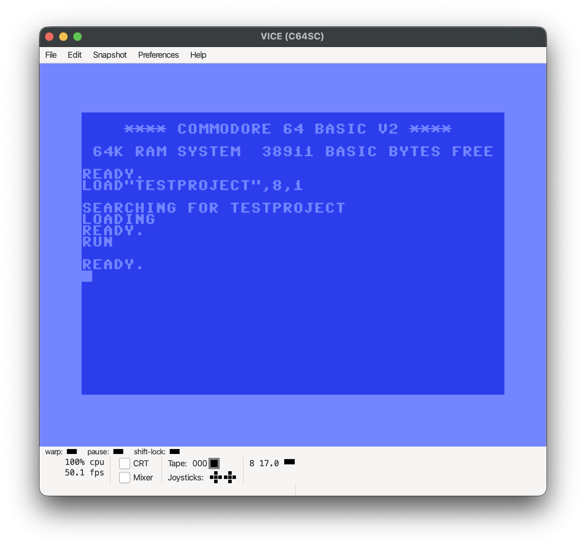

# Running the project

Before you can run the project, you need to set the emulator.
That is discussed in more detail [here](../starting-up/set-emulator.md).

When you have set the emulator, you can run the project from the Compiler menu.

To run the project, select the "Run Project" item.
It builds first an executable file from the project, and uses then the emulator to run it.
When the emulator is started, the status bar for the Compiler tab states
"Started emulator".

Note that when the emulator is started for the first time, 
it may take some time for it to appear in some operating systems.
In any case, running an emulator does not pause or stop the IDE in any way.
You can continue using the IDE while the emulator is running.

As for the example above, the program itself does basically nothing visually
noticeable.

  
:leftwards_arrow_with_hook: [Back to index](../../index.md)

