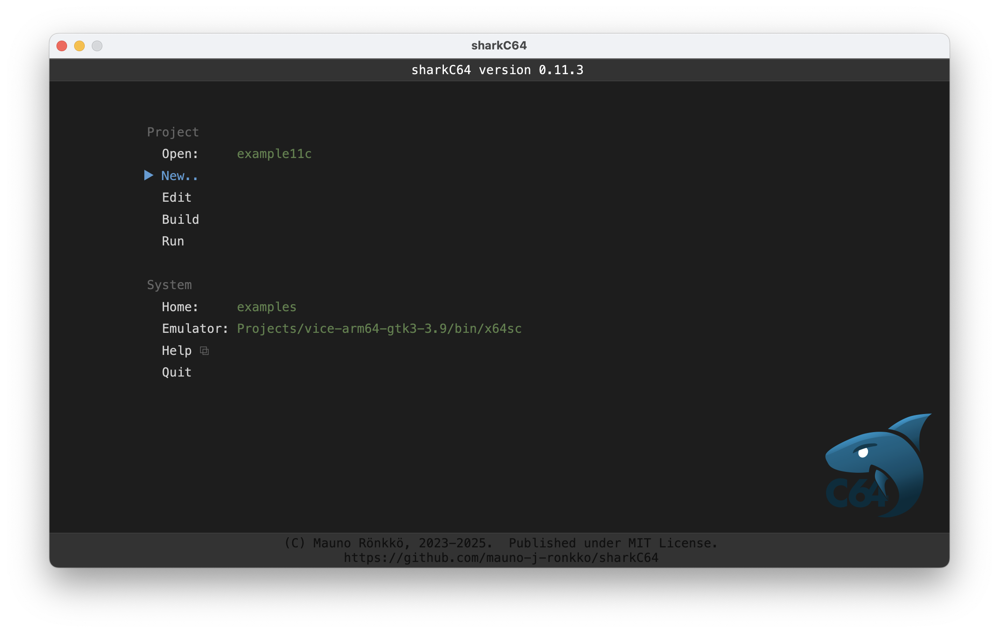
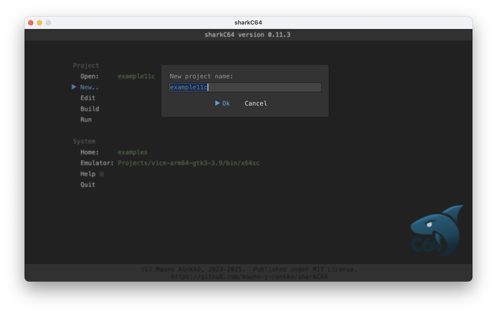

# Creating a new project

The home screen of the sharkC64 IDE looks as follows:

To create a new project, click the New.. action in the Project section.
It will open a dialog asking for the name of the new project.
Type the name of the new project. 
It is then created and the editor view is opened automatically for it. 

Note that you cannot have an existing module with the name of the new project.
If you type the name of an existing module, it will not be overwritten or
opened. A dialog is shown to indicate this and the IDE asks you again
for the name of the new project.

  
:leftwards_arrow_with_hook: [Back to index](../index.md)

