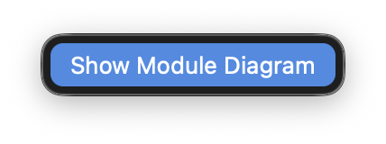
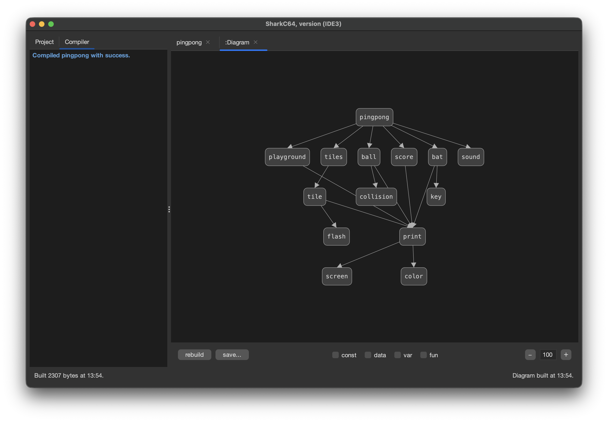
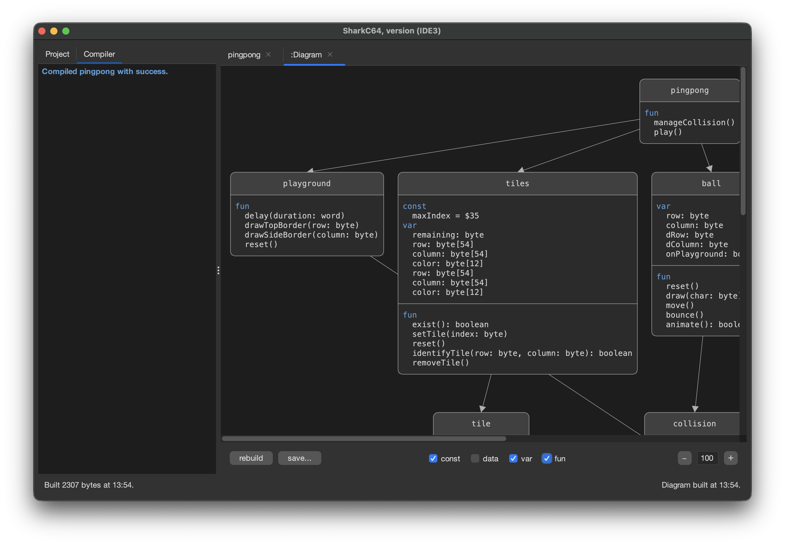
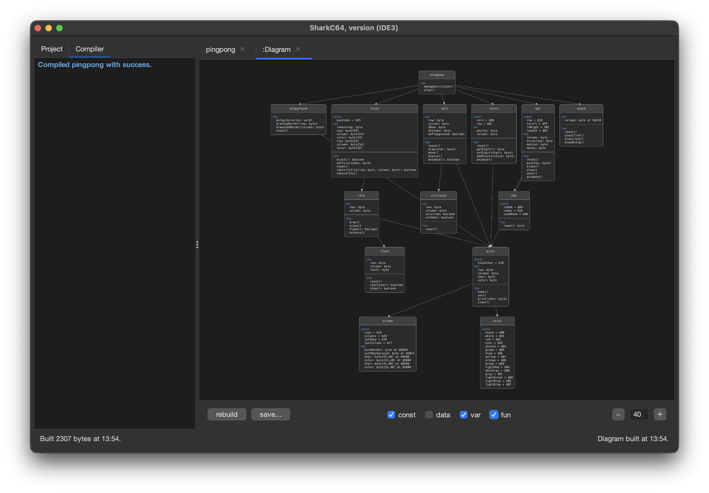
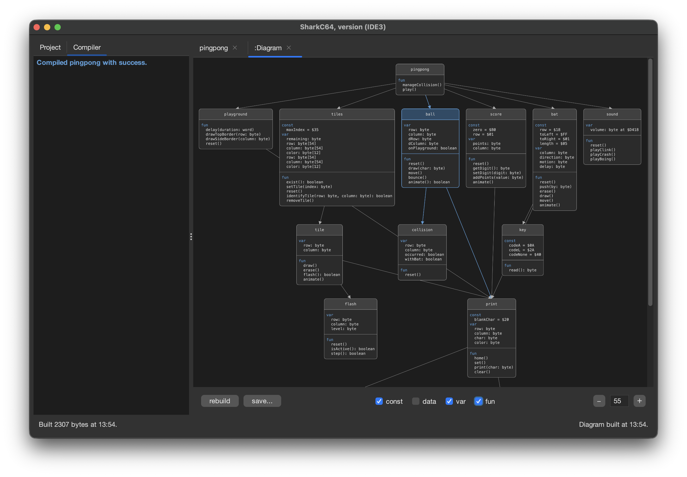
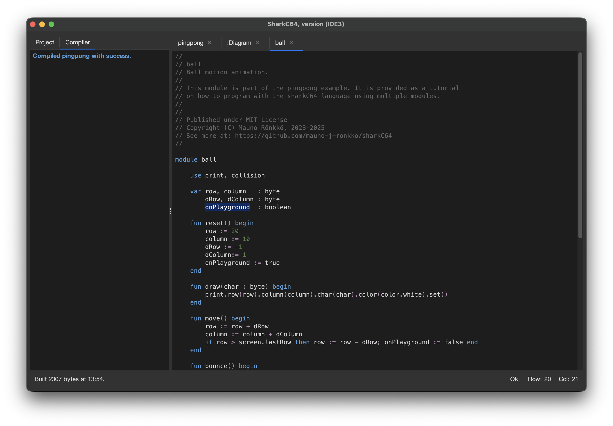

# Viewing a module dependency diagram 

You can open a module dependency diagram for a persisted project from the designer menu.

To open the module dependency diagram for a persisted project, select the "Show Module Diagram" item.
It first builds the entire project and then opens a dependency diagram based on the built information.
The diagram is shown in the Editor view. 
For instance, for the pingpong project, the module dependency diagram looks like this.

You can click which details you wish to see in the diagram with the checkboxes. 
The diagram is updated immediately with your choice.

You can also zoom in and out the diagram, for instance to fit it entire in the view.

If you click a module in the diagram, it is highlighted along with all its dependencies.
This information helps in refining the implementation to minimize unwanted dependencies.

If you click an element in a highlighted module in the diagram, the corresponding module
is opened in the editor with the element selected. For instance, in the image above,
if you click the onPlayground element, it is shown in the editor.

There are also two buttons "rebuild" and "save..." in the control panel.

By clicking "rebuild", the integrated development environment rebuilds
the project and then updates the diagram to match the built project.
This way, once the diagram is opened, you can modify the implementation
and come back to the diagram even if the project does not compile.

By clicking the other button, "save...", you can save the diagram that you see
into a png file. In other words, if you have selected only constants to be
shown in the diagram, the view is then saved into the png file.
Moreover, if you have zoomed out, the png file will also have that zoomed
out content.

  
:leftwards_arrow_with_hook: [Back to index](../../index.md)

