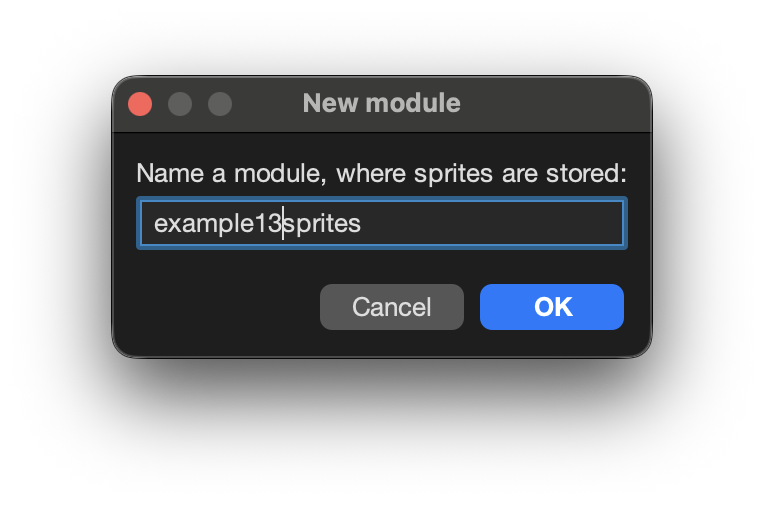
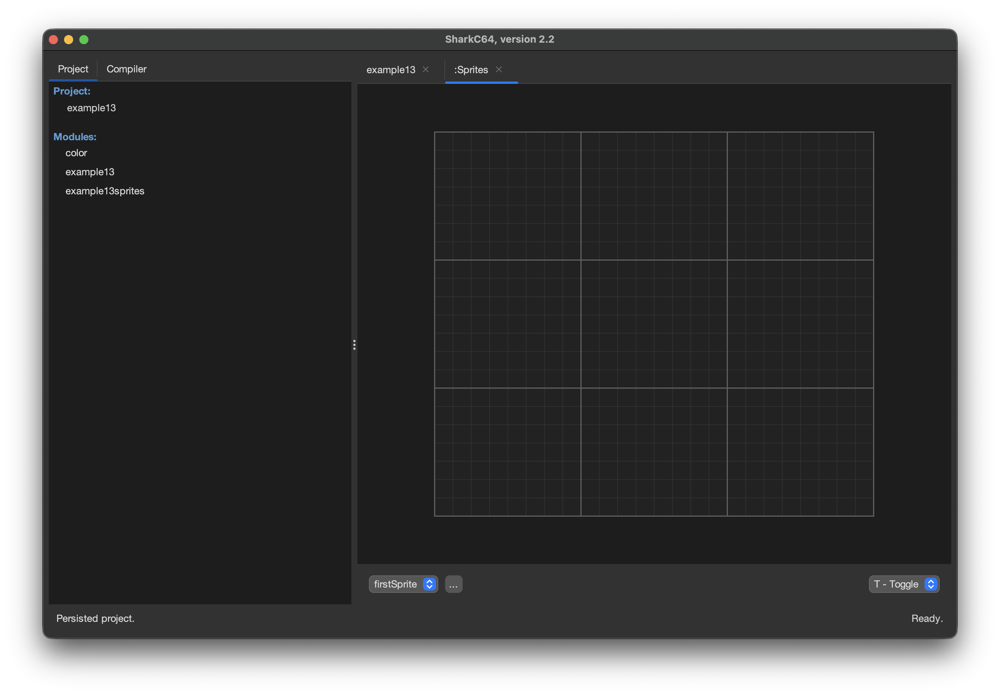
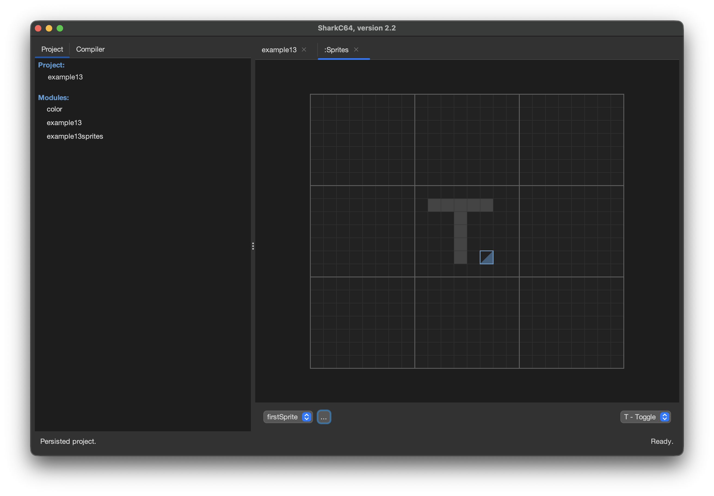
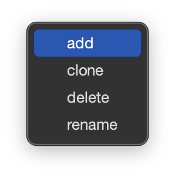
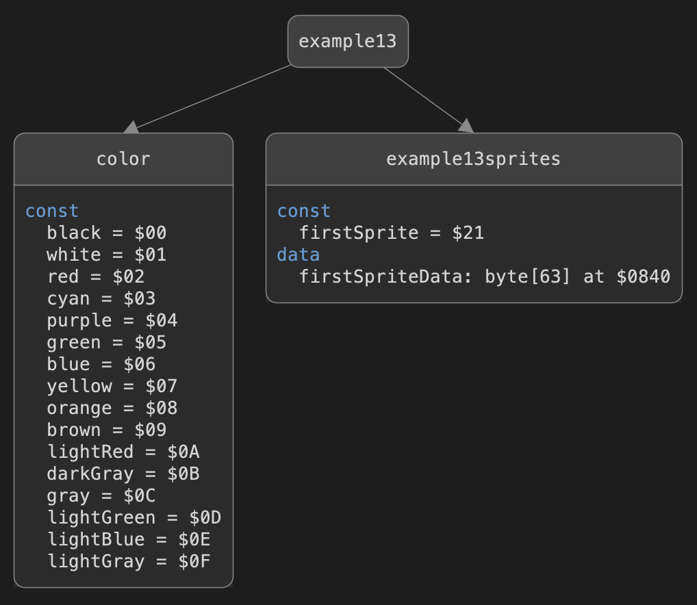

# Editing sprites 

You can open the sprite editor for a persisted project from the designer menu.


When you open the sprite editor for the first time in a project,
it asks a module name for storing the sprites.



Once you give a name for the module, it appears in the project explorer tab
along with a sprite editor shown in the editor view.



At the moment, you can edit one high-resolution sprite at a time in the editor.
To draw an image, you can select one of the three tools from the list of tools
shown in the control panel on the right hand side. 
The toggle tool is selected by default, it toggles the pixel on/off.
When you move mouse over the sprite image, a square with a blue triangle
is shown on the pixel that is to be toggled



The other two tools are paint and erase.
They either set the pixel clicked with a mouse on or off, respectively.


To add, clone, delete, or rename a sprite, click the button with three ellipses,
`...` next to the sprite name. It opens up a popup menu, where you can select
the desired action.



You can select the sprite to be edited from the list of sprite names in the control panel.

You can select File > Save to save the modification of a sprite at any time.
The IDE will save any changes automatically whenever you switch to another sprite
or close the sprite editor.

If you try to open the module reserved for storing the sprites from the
project explorer view, it will open the sprite editor for you.
To investigate what is in the module, you can use the diagram view.
There, you can see how the sprites are stored into the module.



As you can see, each sprite has two entries.
The first entry is a constant value, `firstSprite`, having the index value of the sprite 
to be display by using the sprite index register. For instance,
```
var spriteIndex : byte at $07F8
...
spriteIndex := example13sprites.firstSprite
```
The second entry, `firstSpriteData`, is the sprite data that is stored in the memory location
corresponding to its index value. 
Note that the sprite data is a regular byte array that can be read and modified
during run-time.


<br /><br />
:leftwards_arrow_with_hook: [Back to index](../../index.md)

