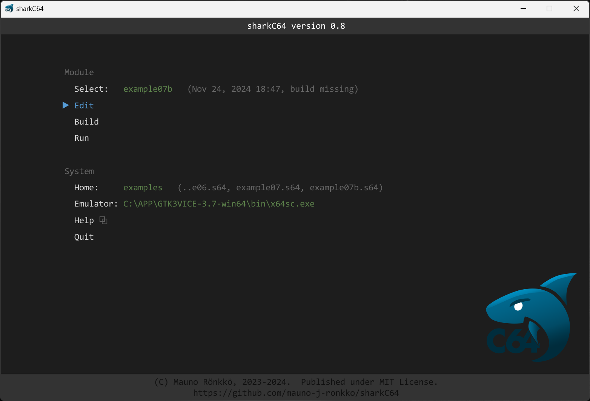
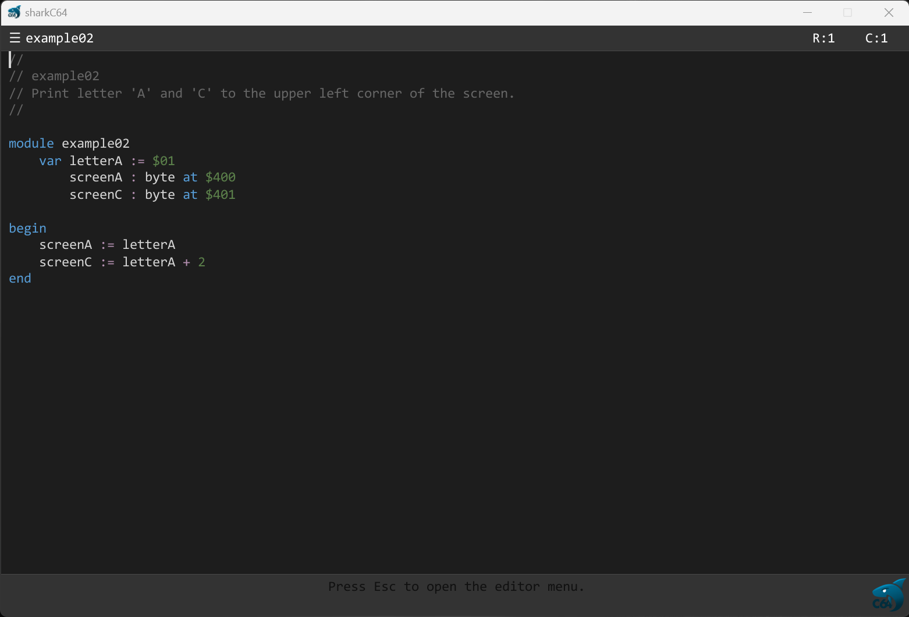
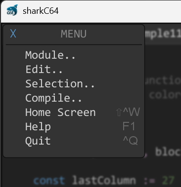
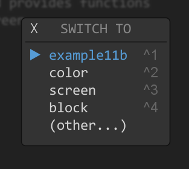

# Editing a module

The home screen of the sharkC64 IDE looks as follows:

To edit a module, click the Edit action in the Project section.
It will open an edit view.

The header row shows a hamburger icon, the name of the project, the name of the opened module,
the current status and the cursor location. The number before the name of the module
indicates the index of the module among already opened modules.
Yes, the sharkC64 development environment supports now multiple open modules!
More on that later.

The editor menu can be accessed by clicking the hamburger icon next to the module name
on the top left screen corner. The editor menu opens directly on top of the hamburger icon.
All the actions in the menu can be accessed by using keyboard shortcuts. 
The shortcut is shown next to the action. 

## Editor menu actions
Here is a list of the editor menu actions:

| Action                                  | Menu item                   | Keyboard shortcut | MacOS keyboard shortcut |
|:----------------------------------------|:----------------------------|-------------------|-------------------------|
| Create new module                       | Module.. > New..            | ctrl + n          | command + n             |
| Open a module                           | Module.. > Open..           | ctrl + o          | command + o             |
| Switch to an already opened module      | Module.. > Switch..         | shift + ctrl + o  |                         |
| Save edited module                      | Module.. > Save             | ctrl + s          | command + s             |
| Close editor view (back to home screen) | Module.. > Close            | ctrl + w          | command + w             |
|                                      |                             |                   |                         |
| Undo the latest change                  | Edit.. > Undo               | ctrl + z          | command + z             |
| Redo the latest undo                    | Edit.. > Redo               | shift + ctrl + z  | shift + command + z     |
| Revert all changes                      | Edit.. > Revert all changes | shift + ctrl + y  | shift + command + z     |
| Find text                               | Edit.. > Find..             | shift + ctrl + f  | shift + command + y     |
| Find next                               | Edit.. > Find next          | ctrl + f          | command + f             |
| Find previous                           | Edit.. > Find previous      | ctrl + g          | command + g             |
| Replace text                            | Edit.. > Replace..          | shift + ctrl + r  | shift + command + r     |
| Replace this occurrence and find next   | Edit.. > Replace next       | ctrl + r          | command + r             |
|                                      |                             |                   |                         |
| Select all                              | Selection.. > Select all    | ctrl + a          | command + a             |
| Cut selected to clipboard               | Selection.. > Cut           | ctrl + x          | command + x             |
| Copy selected to clipboard              | Selection.. > Copy          | ctrl + c          | command + c             |
| Paste from clipboard                    | Selection.. > Paste         | ctrl + v          | command + v             |
| Delete selection                        | Selection.. > Delete        | Delete            | Delete                  |
|                                      |                             |                   |                         |
| Compile module in editor                | Compile.. > Compile         | F9                | F9                      |
| Show next compilation error             | Compile.. > Show next error | ctrl + F9         | command + F9            |
| Build the project                       | Compile.. > Build           | F10               | F10                     |
| Build and run the project               | Compile.. > Build and run   | F11               | F11                     |
|                                      |                             |                   |                         |
| Show editor Help (this page)            | Help                        | F1                | F1                      |
| Quit sharkC64                           | Quit                        | ctrl + q          | command + q             |

Note that compiling in the editor view is literally just the compilation action.
It will not produce any executable prg file. 
To produce an executable prg file and to run it, select build and run module from the menu. 

## Switching between opened modules
The sharkC64 development environment supports now multiple open modules.
You can see a list of all the opened modules by selecting the "Switch.." item from the
"Module.." menu. Alternatively, you can open that list just by clicking shift+ctrl+o
(or shift+cmd+o with a mac).
The list of all the opened modules looks something like this.

If the list does not contain the module that you wish to open, you can click the
"(other..)" item. That will open a dialog for opening any existing module.
As the list of opened module shows, the first five modules can also be accessed
with a shortcut key ctrl-1 through ctrl-5 (or cmd-1 through cmd-5 with a mac).
The shortcut key works directly in the editor without a need to open any intermediate
dialogs. It makes it fast and clutter-free to switch between modules. 

Note that, when switching, the find and replace actions carry the find and replace
patterns from one module to the other. This means, for instance, that replacing
text across modules is easier. Still, one has to actively switch from one
module to another - the find and replace actions do not switch the modules.

To read more about the programming language and its syntax, see the language [index](../index.md) .

  
:leftwards_arrow_with_hook: [Back to index](../index.md)

