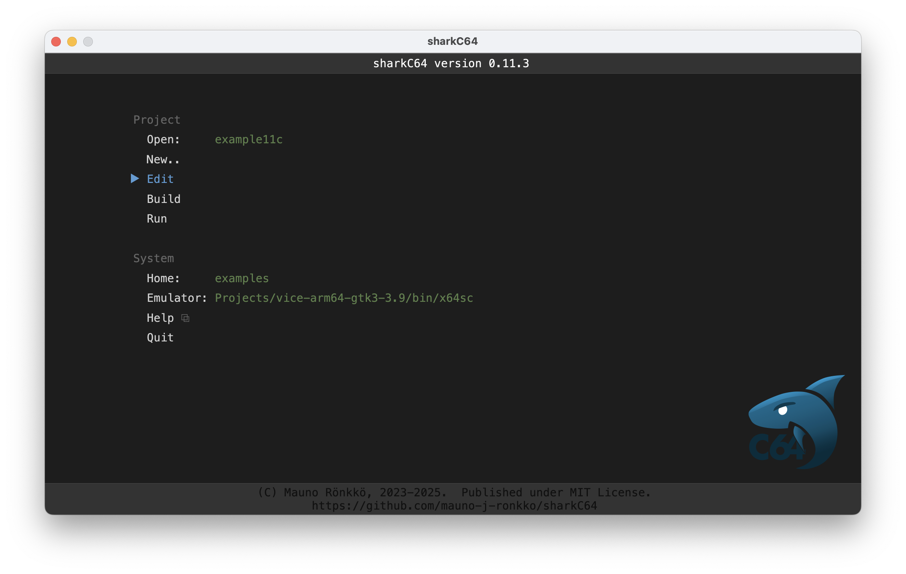
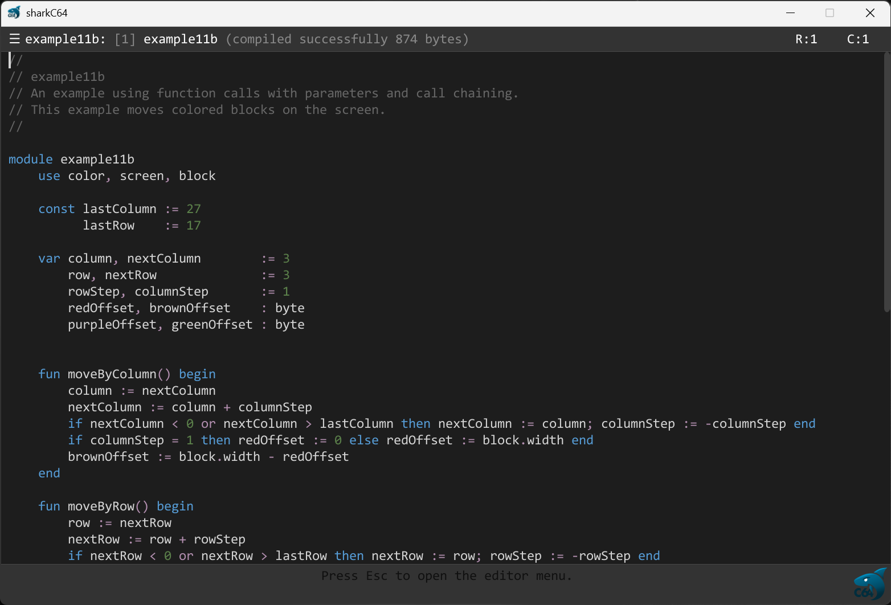

# Editing the active module

The home screen of sharkC64 looks as follows (captured on version 0.3):

To edit an active module, click the Edit action in the Module section.
It will open an edit view.

The editor menu can be accessed by clicking the hamburger icon next to the module name
on the top left screen corner. The editor menu opens directly on top of the hamburger icon.
All the actions in the menu can be accessed by using keyboard shortcuts. 
The shortcut is shown next to the action. 

## Editor menu actions
Here is a list of the editor menu actions:

| Action                                  | Menu item                   | Keyboard shortcut | MacOS keyboard shortcut |
|-----------------------------------------|-----------------------------|-------------------|-------------------------|
| Save module source code                 | Module.. > Save             | ctrl + s          | command + s             |
| Close editor view (back to home screen) | Module.. > Close            | ctrl + w          | command + w             |
| Undo the latest change                  | Edit.. > Undo               | ctrl + z          | command + z             |
| Redo the latest undo                    | Edit.. > Redo               | shift + ctrl + z  | shift + command + z     |
| Find text                               | Edit.. > Find..             | shift + ctrl + f  | shift + command + f     |
| Find next                               | Edit.. > Find next          | ctrl + f          | command + f             |
| Find previous                           | Edit.. > Find previous      | ctrl + g          | command + g             |
| Replace text                            | Edit.. > Replace..          | shift + ctrl + r  | shift + command + r     |
| Replace this occurrence and find next   | Edit.. > Replace next       | ctrl + r          | command + r             |
| Select all                              | Selection.. > Select all    | ctrl + a          | command + a             |
| Cut selected to clipboard               | Selection.. > Cut           | ctrl + x          | command + x             |
| Copy selected to clipboard              | Selection.. > Copy          | ctrl + c          | command + c             |
| Paste from clipboard                    | Selection.. > Paste         | ctrl + v          | command + v             |
| Delete selection                        | Selection.. > Delete        | Delete            | Delete                  |
| Compile module source code              | Compile.. > Compile         | ctrl + F9         | command + F9            |
| Show next compilation error             | Compile.. > Show next error | F9                | F9                      |
| Show editor Help (this page)            | Help                        | F1                | F1                      |
| Quit sharkC64                           | Quit                        | ctrl + q          | command + q             |

Note that compiling in the editor view is literally just the compilation action.
It will not produce any executable prg file. To produce an executable prg file, 
and to run it, close first the editor view to get back to the home screen.
You can then select build or run action from the home screen to build or run the module.

To read more about the programming language and its syntax, see the language [index](../index.md) .

  
:leftwards_arrow_with_hook: [Back to index](../index.md)

