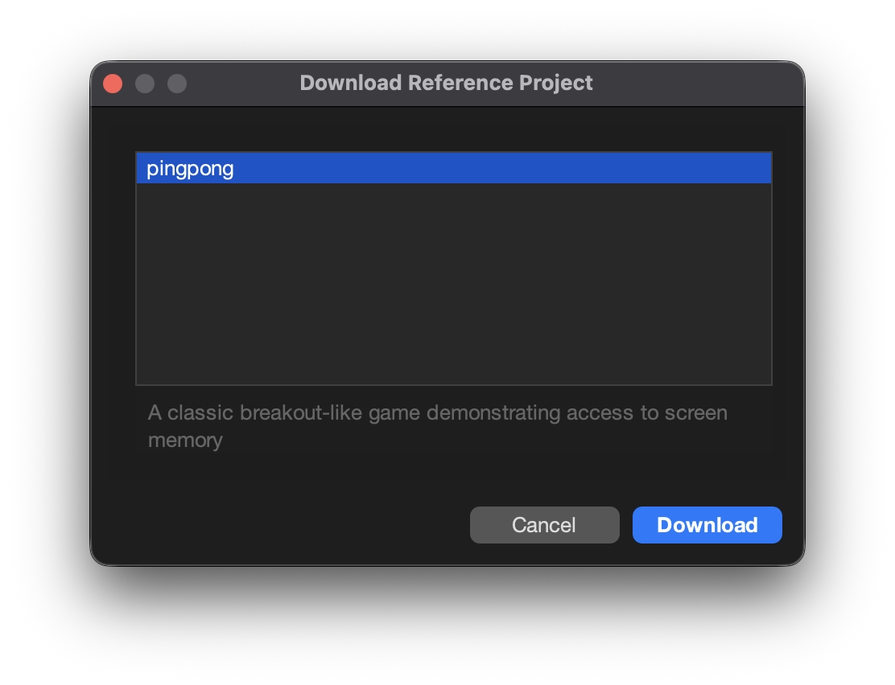
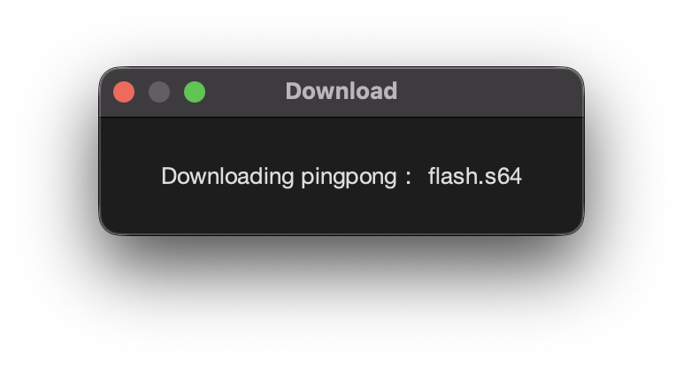
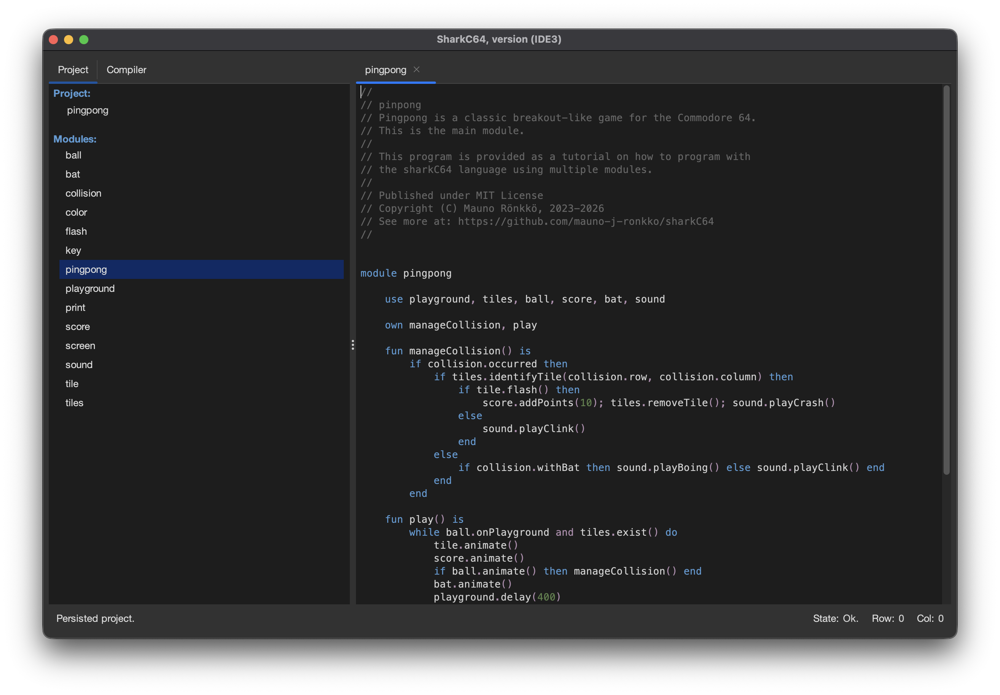

# Downloading an example

You can download both short examples reference projects.
Downloading of a short example is done from the Help menu.

When you select the "Download Example..." item, it opens a dialog that lets you select the
example to be downloaded. In the figure below, the example 10 is selected.

Once you click the "Download" button, the code snippet is downloaded to the home directory.
If you did not have any project open, the SharkC64 creates a transient project for the
example. If you had a project open, the downloaded example is added to the project.
In the figure below, no project was open, when the example was downloaded.
Then, a transient project is created for the downloaded example

## Downloading a reference project

SharkC64 provides also entire reference projects to download and experiment with.
Each project consists of several modules.

To download a reference project, select "Download Reference Project..." from the Help menu. 
When you select it, a dialog is shown that lets you select the project to be downloaded. 

Once you select a project, and click the Download button, 
SharkC64 starts to download all the modules of that project and shows a progress dialog.
A downloaded project is automatically stored as a persisted project.

After all the modules have been downloaded, SharkC64 opens the project.
You can then run and experiment with it freely.

  
:leftwards_arrow_with_hook: [Back to index](../../index.md)

