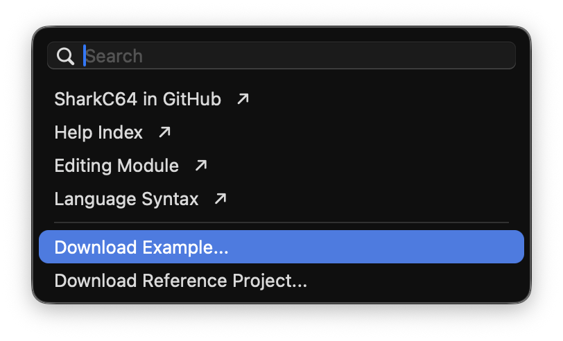
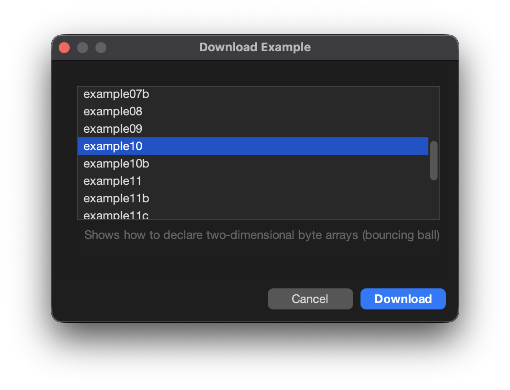
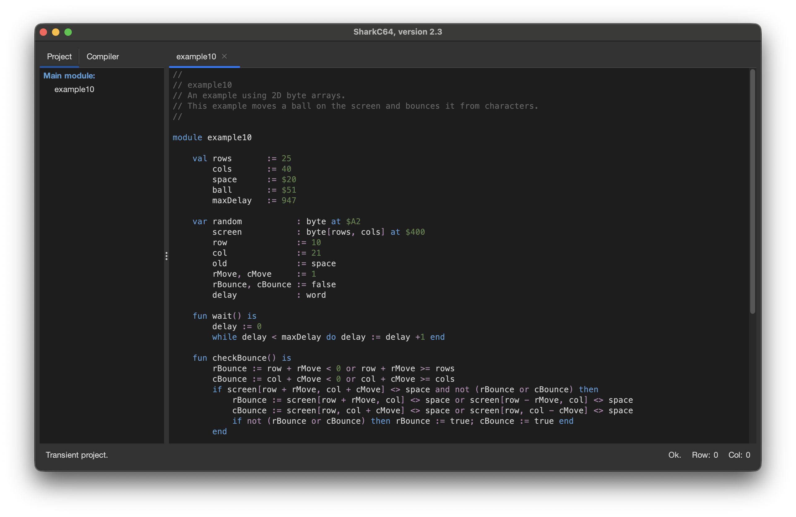

# Downloading an example

You can download an example from the Help menu.

When you select the "Download Example..." item it opens a dialog that lets you select the
example to be downloaded. In the figure below, the example 10 is selected.

Once you click the "Download" button, the example is downloaded to the home directory.
If you did not have any project open, the sharkC64 creates a transient project for the
example. If you had a project open, the downloaded example is added to the project.
In the figure below, no project was open, when the example was downloaded.
Then, a transient project is created for the downloaded example

  
:leftwards_arrow_with_hook: [Back to index](../../index.md)

