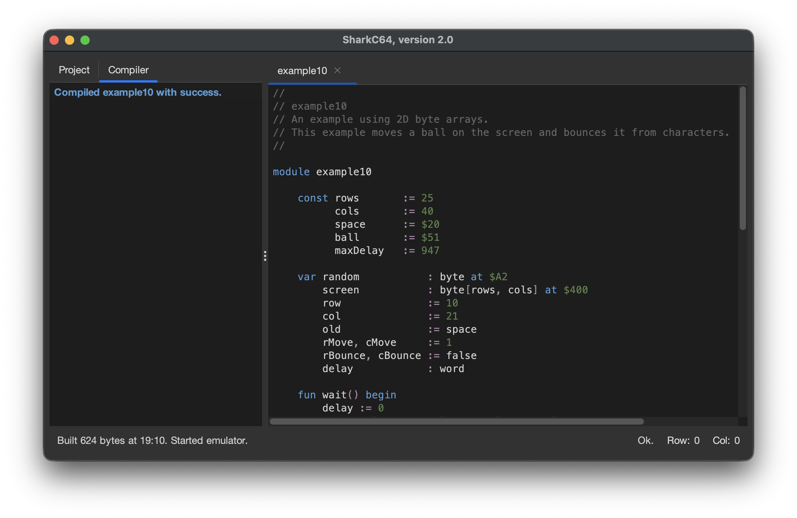
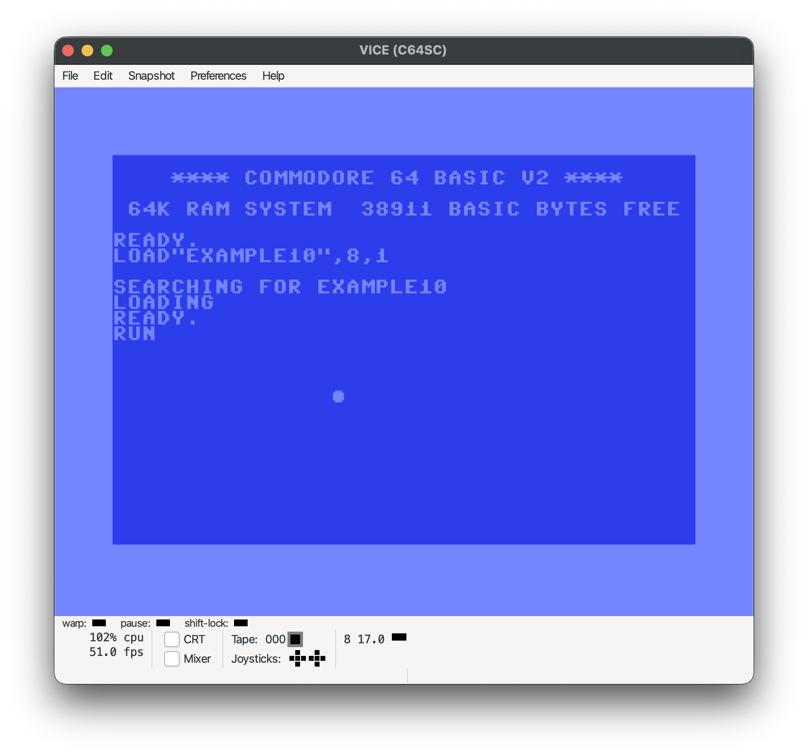

# Running a downloaded example

When you download an example, a transient project is created automatically.
You can build and run the project from the Compiler menu.

To build and run the project, select the "Run Project" item from the menu.
It compiles the module, builds the executable program, and the runs it with
the given emulator. You can read more about setting the emulator in the
section [Setting the emulator for running a program](../starting-up/set-emulator.md).

When the sharkC64 IDE has compiled the project successfully, it shows the result
in the Compiler tab. It also indicates in the status line at the bottom of the window
that it has started running the emulator. Depending on which emulator and which
operating system you use, starting the emulator may take some time, when you
run the project for the first time. 

If the emulator starts successfully, the build project is launched automatically.

Note that som examples may depend on other example modules.
To run such examples, you also need to download the used modules.

As for the compiler menu, it has an item "Compile Module" for just compiling the active module.
The "Build Project" item builds an executable program from the project without running it.

  
:leftwards_arrow_with_hook: [Back to index](../../index.md)

