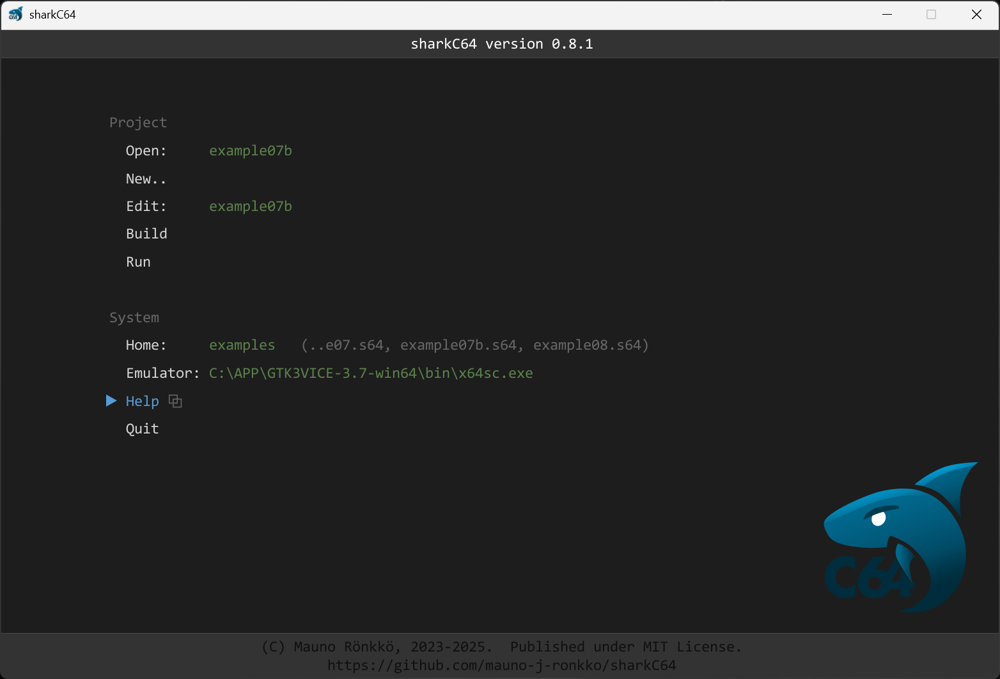

# Home screen

The home screen of the sharkC64 IDE looks as follows:

It has two sections with actions. The Project section has actions for:
- [Opening an existing project](ide/opening)
- [Creating a new project](ide/creating-new.md)
- [Editing a module](ide/editing.md)
- [Building the project](ide/building.md)
- [Running the project](ide/running.md)

The System section has actions for:
- [Setting the home folder](ide/setting-home.md)
- [Setting the emulator command for running a program](ide/setting-emulator)
- showing help with the default browser (opens this page)
- quiting the sharkC64 IDE

You can select an action by using the arrow keys and the enter key, 
or by clicking it with a mouse.

  
:leftwards_arrow_with_hook: [Back to index](../index.md)

