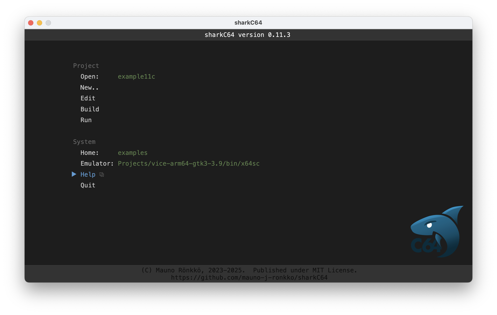

# Home screen

The home screen of the sharkC64 IDE looks as follows (captured on version 0.3):

It has two sections with actions. The module section has actions for:
- [selecting an active module](selecting.md)
- [editing the module](editing.md)
- [building a runnable prg file for the module](building.md)
- [running a built module with the runner command](running.md)

The System section has actions for:
- [setting the home folder for the project](setting-home.md)
- [setting the runner command for running a built module](running.md)
- showing help with the default browser (opens this page)
- quiting the sharkC64 IDE

You can select an action by using the arrow keys and the enter key, 
or by clicking it with a mouse.

  
:leftwards_arrow_with_hook: [Back to index](../index.md)

