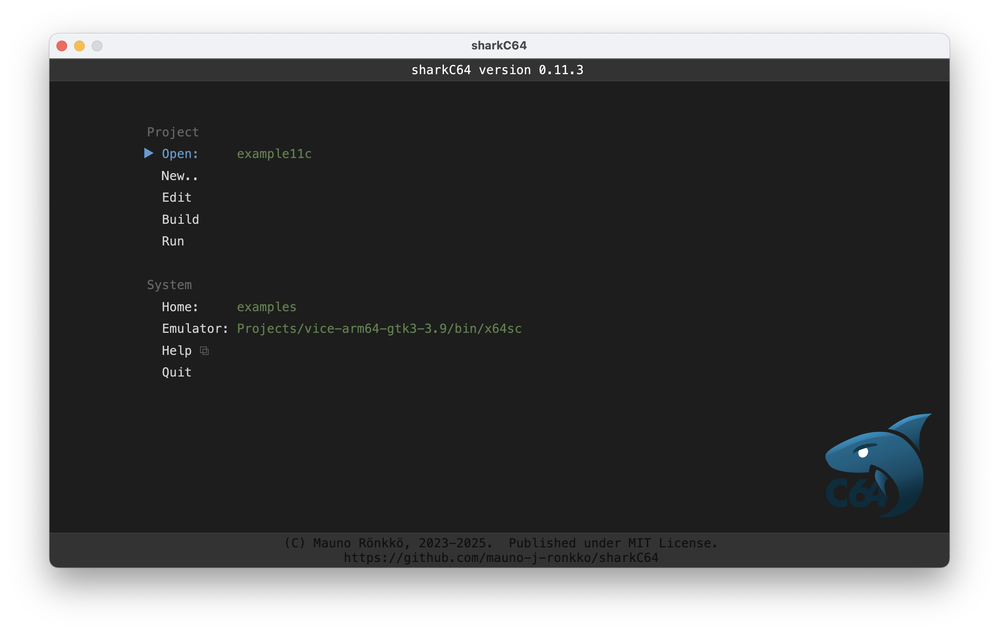

# Opening an existing project

The home screen of the sharkC64 IDE looks as follows:

To open an existing project, click the Open action in the Project section.
It will open a dialog showing all modules in the Home folder.
Pick the main module of the project that you wish to open.

  
:leftwards_arrow_with_hook: [Back to index](../index.md)

