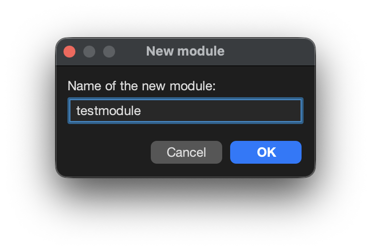
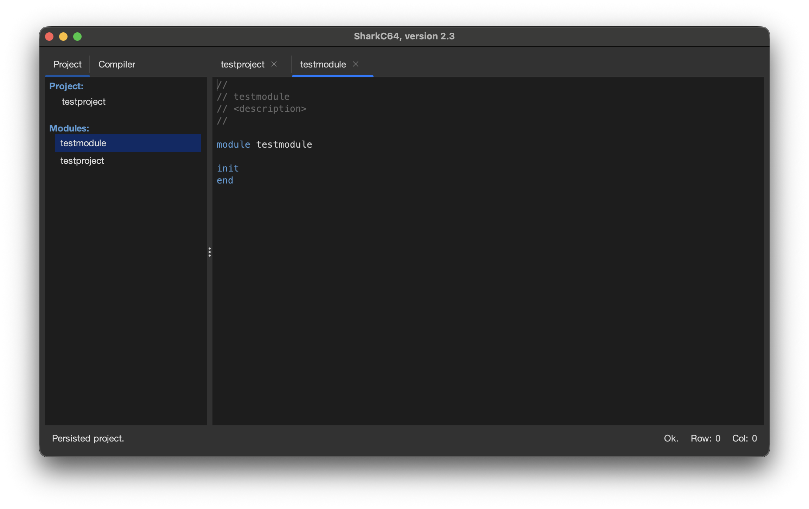

# Adding a new module to the project

You can create a new module to the project from the File menu.

To create a new module, select the "New..." item.
It opens a dialog, where you can give the name of the module.
The name must start with a letter, and it can contain only letters and numbers.

Once, you give a valid module name, the module is created and added to the project.
It shows in Project tab, in the explorer view. The new module is also opened in the editor view.

You can switch between the modules in the editor view by clicking the tabs.
You can also close modules in the editor view and open them back by clicking them
in the Project tab in the explorer view.

  
:leftwards_arrow_with_hook: [Back to index](../../index.md)

