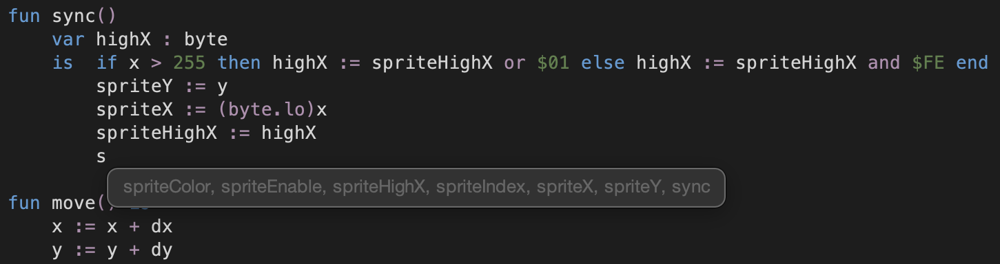
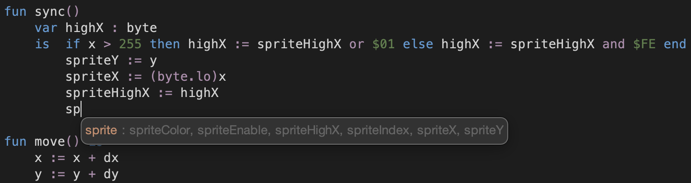
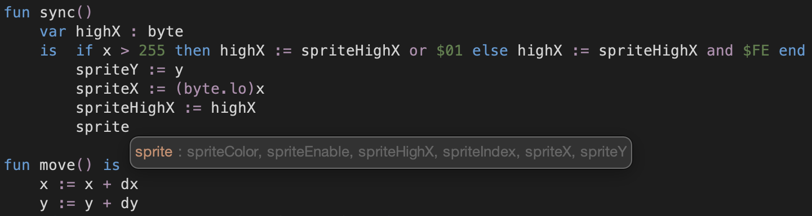
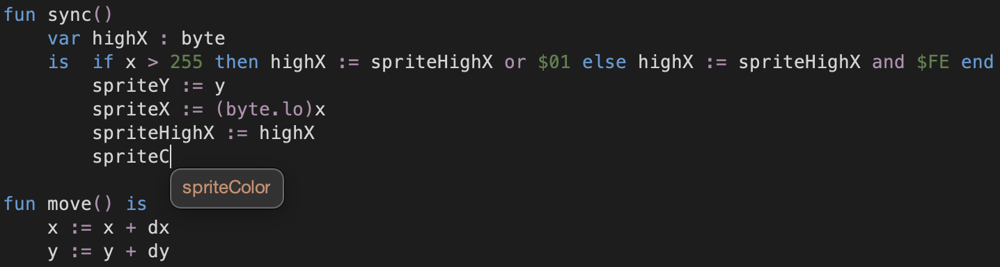
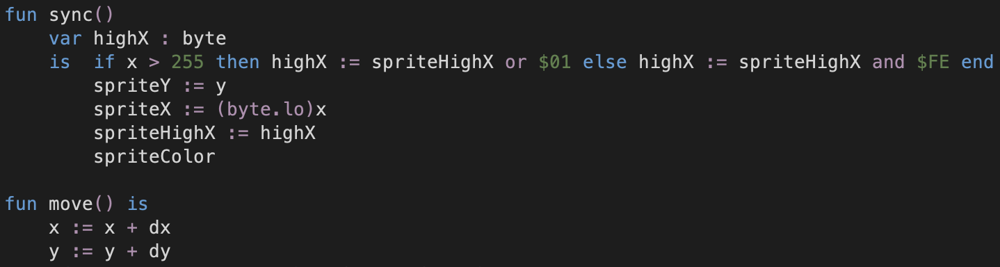

# Working with autocomplete 

The source code editor has a build in autocomplete.
It uses a session-based in-memory vocabulary that is collected 
as modules are opened for editing.
The vocabulary is also updated with labels found on a row, 
when return key or up/down arrow keys are pressed.
When a sprite editor is used, all sprite names are included to the vocabulary.
The vocabulary is cleared, when you close the development environment.
When you open a project, the vocabulary is populated with labels and keywords 
that are found in modules that are opened in editor view when the project opens.

When you press a letter or a number key, the editor looks for 
the beginning of a label or keyword on the left side of the cursor. 
It then looks for candidates from the vocabulary on displays them all in a popup.

Suppose, you press the letter `s` in a module containing many candidates related to sprites,
you get the following autocomplete suggestion. Since there are many alternatives,
the list is shown with gray color.

When you next press the letter `p`, the list of candidates is narrowed so
that all candidates start with a common prefix, `sprite`. 
This is shown in the popup with orange color.

If you now press `tab`, it will fill in the common prefix.

If you continue by pressing the letter `C`, the list of suggestions narrows to
exactly one, which is shown in the list using orange color.

Lastly, if you press `tab` again, it will fill in the rest of the label.

The matching of candidates in the vocabulary is done so that 
all candidates must start with the same first letter as is found 
in the beginning of label or keyword on the left side of the cursor.
After that, however, for a word in the vocabulary to match,
it is sufficient that all subsequent letters appear in the word
in the same order. There can be other letters or digits in between.

In practise, this means that you can get the exact suggestion
with a couple of letters, if those letters appear uniquely in that suggestion.
For instance, in the example above, the label `spriteColor` 
would have shown as a single, unique suggestion simply by typing `sC`.

> :information_source: &nbsp; You can hide the suggestion popup by pressing `esc`.

  
:leftwards_arrow_with_hook: [Back to index](../../index.md)

