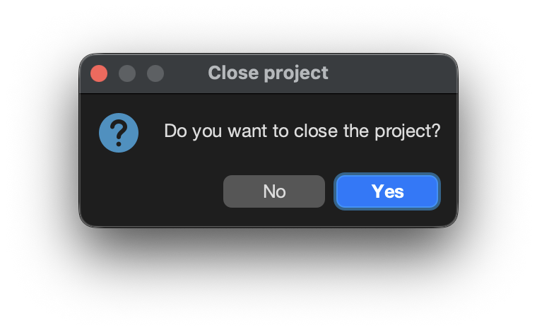
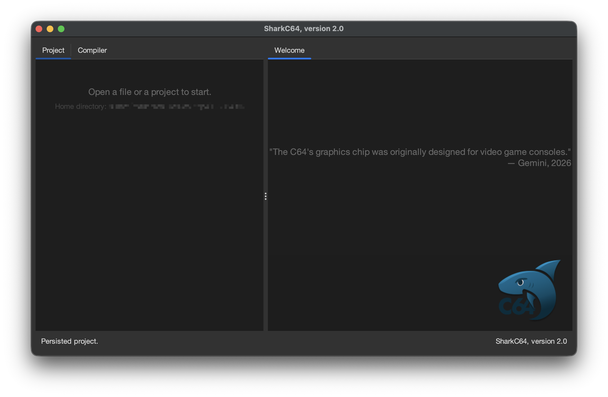

# Closing an open project

You can close an open project from the File menu.

When you have a project open, it shows in the Project tab.

To close the project, select the "Close Project" item.
When you select the item, it opens a dialog to confirm that you want to close the project.

When you click the "Yes" button, all the modules that are open in the editor view
are first saved. Then, all modules are closed in the editor view.
Lastly, project is closed in the Project tab.

When a project is closed, it stores the list of open modules.
The list of open modules is used to reopen them
when the project is opened again.

  
:leftwards_arrow_with_hook: [Back to index](../../index.md)

