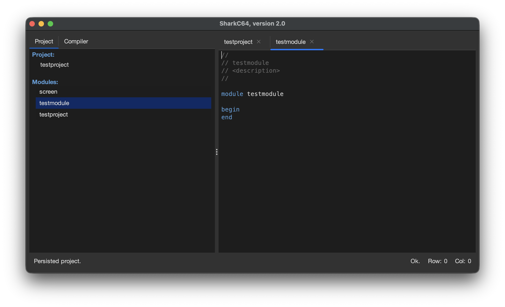
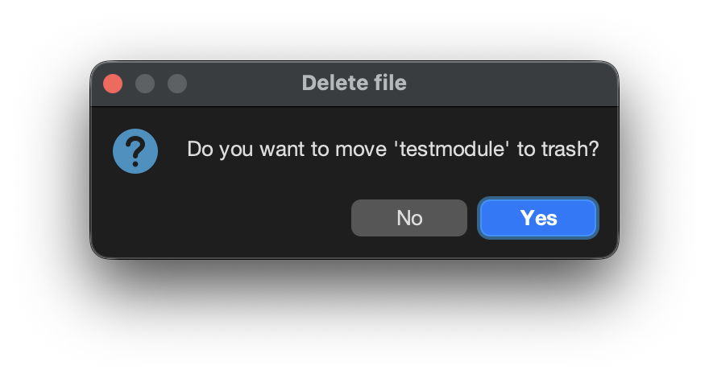
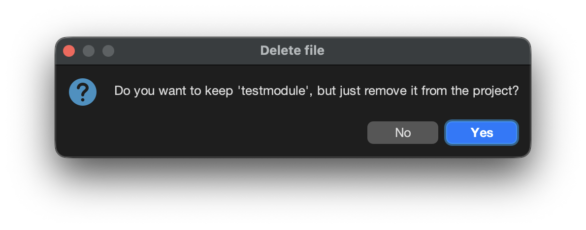

# Deleting a new module from the project

You can create delete module from the project through the File menu.

To create delete a module, select the module to be deleted
either from the Project tab or from the editor view.

Then, select the "Delete" item from the File menu.
It opens a dialog asking fi you want to move the module to trash. 

If you click "Yes" the module will be removed from the project and moved to trash.
If you click "No" another dialog opens asking if you want to keep the module file,
but just remove it from the project.

If you click "Yes" the module file will persist, it is only removed from the project.

Note that you cannot remove the main module of the project.

  
:leftwards_arrow_with_hook: [Back to index](../../index.md)

