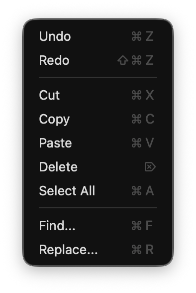
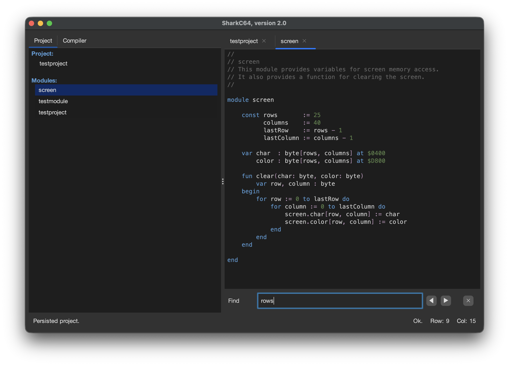
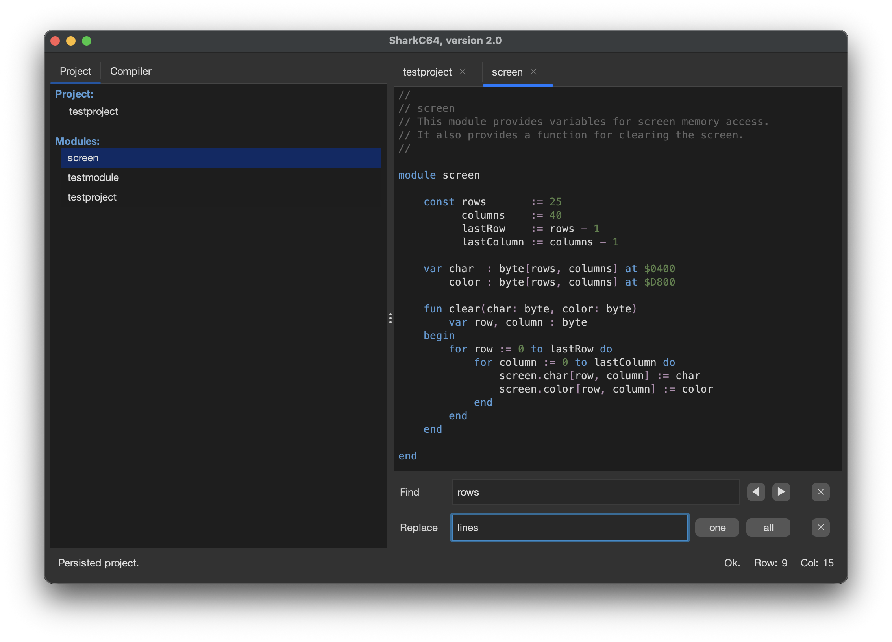

# Editing a module

The source code of a module is shown in the editor view.
Each module is in its own tab.

The status row below the source code shows if the module has been changed or saved.
It also shows the location of the cursor.

Currently, the editor supports all basic editing functionalities, which
can also be accessed through Edit menu.

The editor supports undo and redo actions, as well as standard cut-copy-paste actions.

## Find action

If you select the "Find..." item from the menu, it opens the find panel below the source code.

In the panel, you can type the text to be found. 
You can move to the next or previous instance of the text by clicking the arrow buttons
next to the text field.
You can close the entire find panel by clicking the cross button next to the arrow buttons.

## Replace action

If you select the "Replace..." item from the menu, it opens the replacement panel below the find panel.

In the panel, you can type the text to be used in replacing the found text.
You can replace the highlighted instance by clicking the "one" button.
You can replace all the text instances by clicking the "all" button.
You can close the entire replacement panel by clicking the cross button next to the "all" button.

## Switching between modules
You can switch between the modules by clicking the tab name in the editor view.
Alternatively, you can click the module name in the Project tab to open the module
in the editor view.
You can close a module by clicking the cross button next to the tab name.

  
:leftwards_arrow_with_hook: [Back to index](../../index.md)

