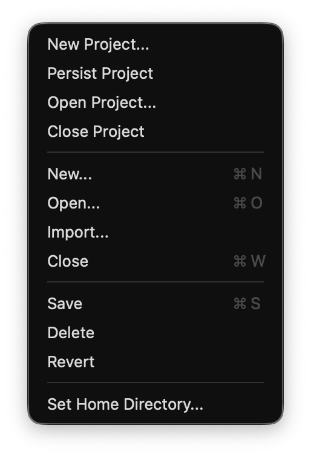
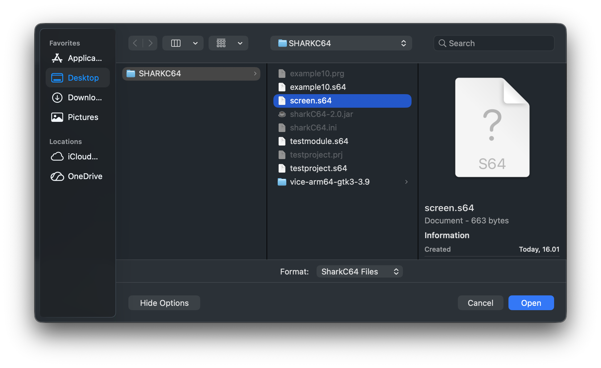
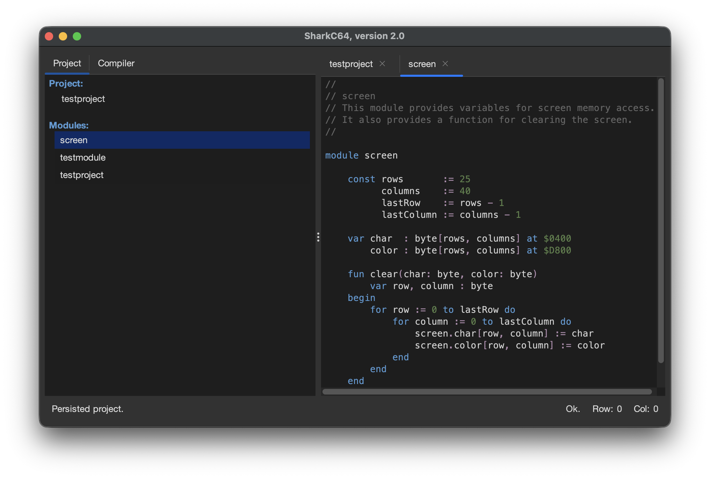

# Importing an existing module to the project

You can import an existing module to the project from the File menu.

To import a module, select the "Import..." item.
It opens a dialog, where you can select the module to be imported.

Once, you have selected the module, it is added to the project and shown in the editor view.

Note that the import action fails, if you already have a module with the same name in the project.
Also, if you have project open, and you download and example from the Help menu,
it will automatically be added to the project.

  
:leftwards_arrow_with_hook: [Back to index](../../index.md)

