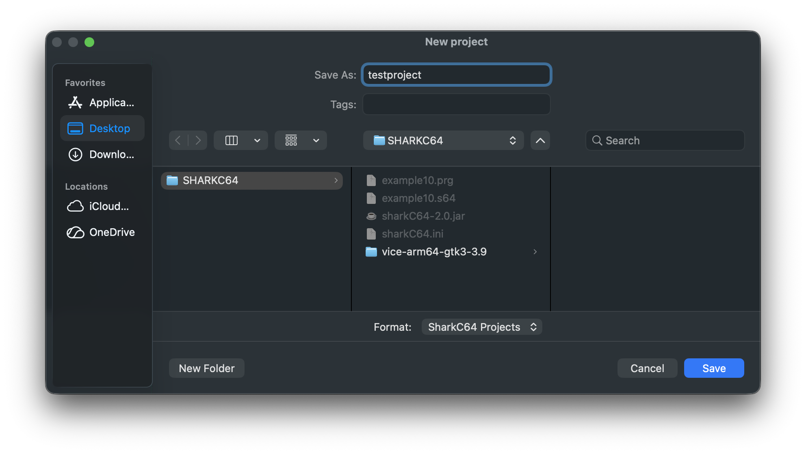
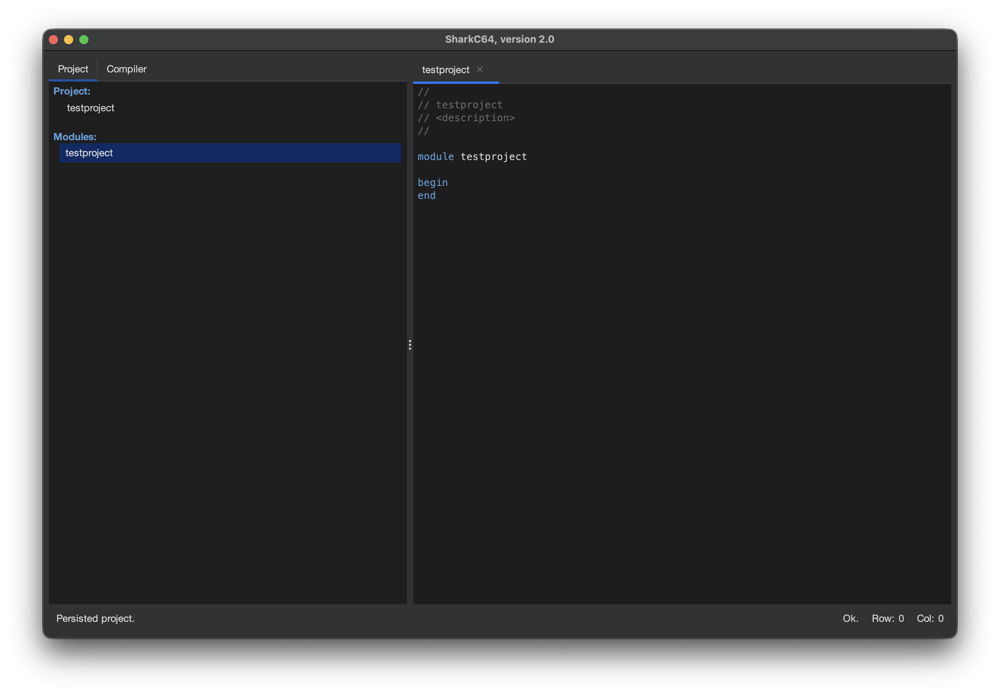

# Creating a new project 

You can create a new project from the File menu.

To create a new project, select the "New Project..." item.
It opens a dialog, where you can give the name of the project.
The name must be a valid module name; that is, it has to start with a letter,
and it can contain only letters and numbers.

Once, you click the Save button on the dialog, sharkC64 creates the new project with
the main module. The name of the main module is the same as the name of the project.
The sharkC64 IDE opens also the main module in the editor view.

Note that the status bar for the Project tab indicates that this is indeed
as persisted project that can be reopened after closing the IDE.
The home screen of the sharkC64 IDE looks as follows:

  
:leftwards_arrow_with_hook: [Back to index](../../index.md)

