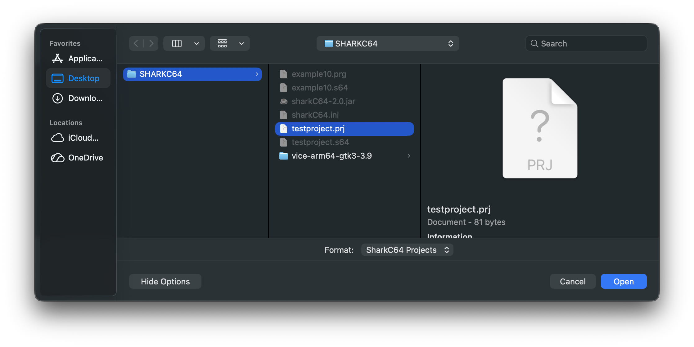

# Opening an existing project

You can open an existing project from the File menu.

To open a new project, select the "Open Project..." item.
It opens a dialog, where you can select the project to be opened.

Once, you click the Open button on the dialog, the project is opened,
and the main module is shown in the editor view.

  
:leftwards_arrow_with_hook: [Back to index](../../index.md)

