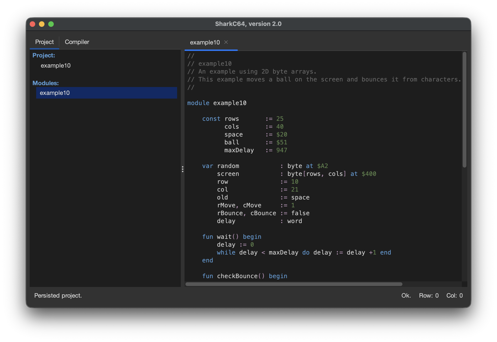

# Persisting a transient project

You can persist a transient project from the File menu.

Suppose you have a transient project open as in the picture.

To persist the project, select the "Persist Project" item.
Then, a project file is created. The open module is saved as the main module.

  
:leftwards_arrow_with_hook: [Back to index](../../index.md)

