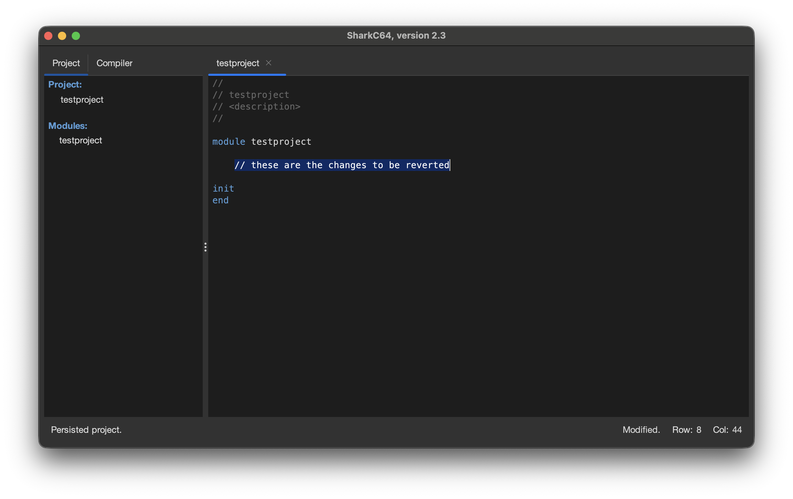
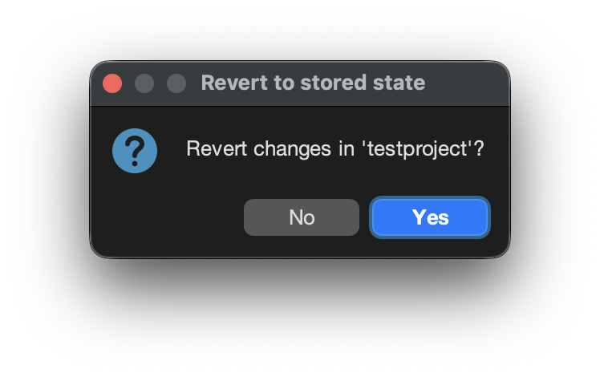
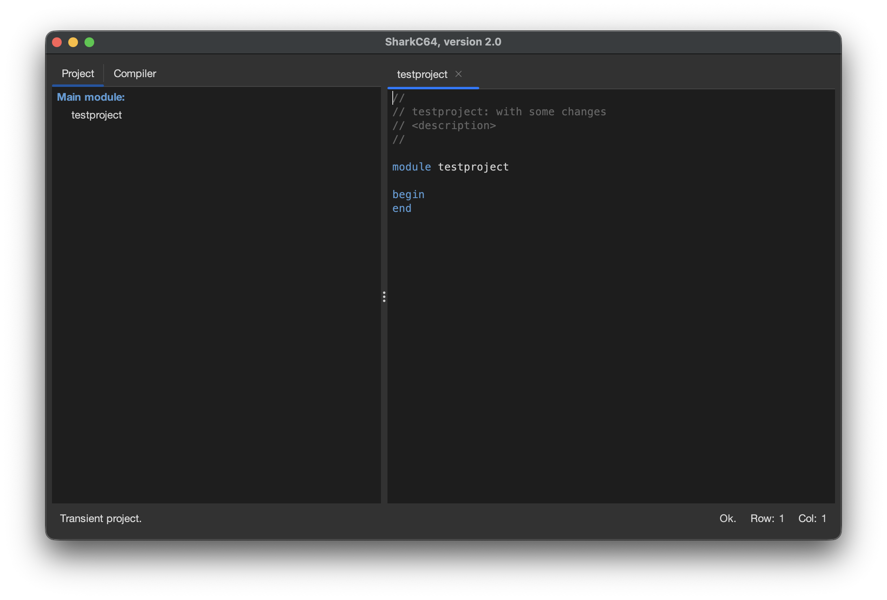

# Reverting module to original state

You can revert all changes in a module to the state that it had,
when you opened it. This can be done from the File menu.

When you have changes in a module, the status bar indicates that with the state "Modified".

To revert all the changes in a module, select the "Revert" item from the File menu.
Then, a dialog is opened to confirm the revert action.

When you click "Yes" button, all the changes to the module are reverted.

After the revert action, the status bar shows the "Ok" state.

Note that the reverted state corresponds to the state of the module
when it was opened in the editor view. So, even if you have made changes and saved them,
the reverted state will pull back the original state of the module,
effectively reverting also the saved changes.
Thus, if you close the IDE and open it again, the reverted state will correspond 
to the state of the module then.
If you close the module and then reopen it, the reverted state will
then be the latter, reopened state.

  
:leftwards_arrow_with_hook: [Back to index](../../index.md)

