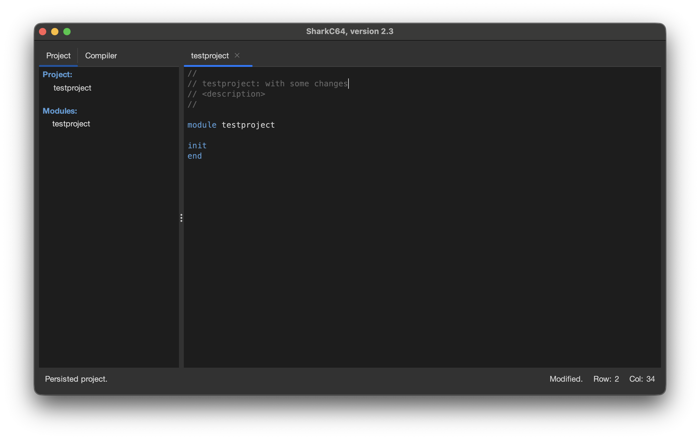
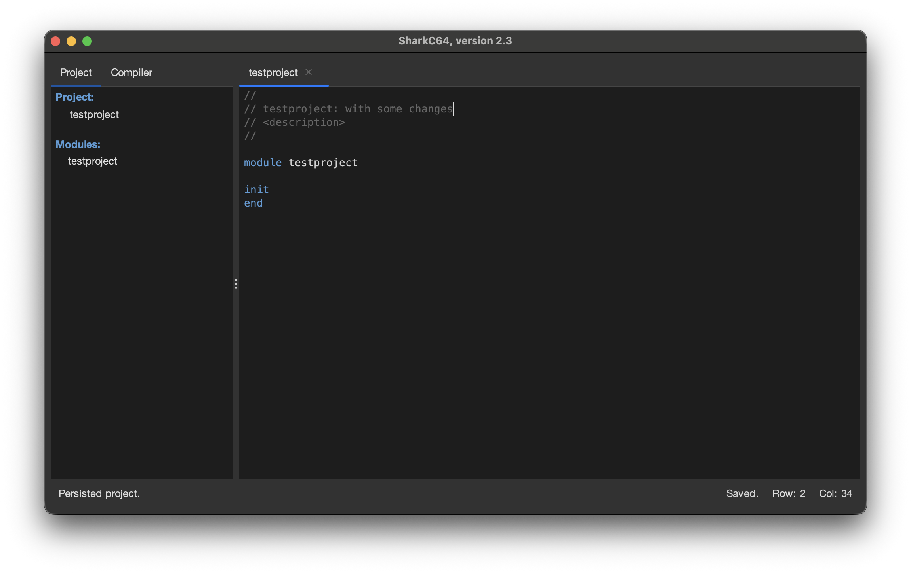

# Saving changes in a module

You can save the changes you made to a module from the File menu.

When you have made some changes to a module, the status bar indicates that
with the state "Modified".

To save the changes, select the "Save" item from the File menu.
After saving the changes, the status bar shows a "Saved" state.

Note that the SharkC64 IDE saves automatically all changes in a module when you close it
or quit using the IDE. Automatic saving is also applied, when you try to build or run a project. 

  
:leftwards_arrow_with_hook: [Back to index](../../index.md)

