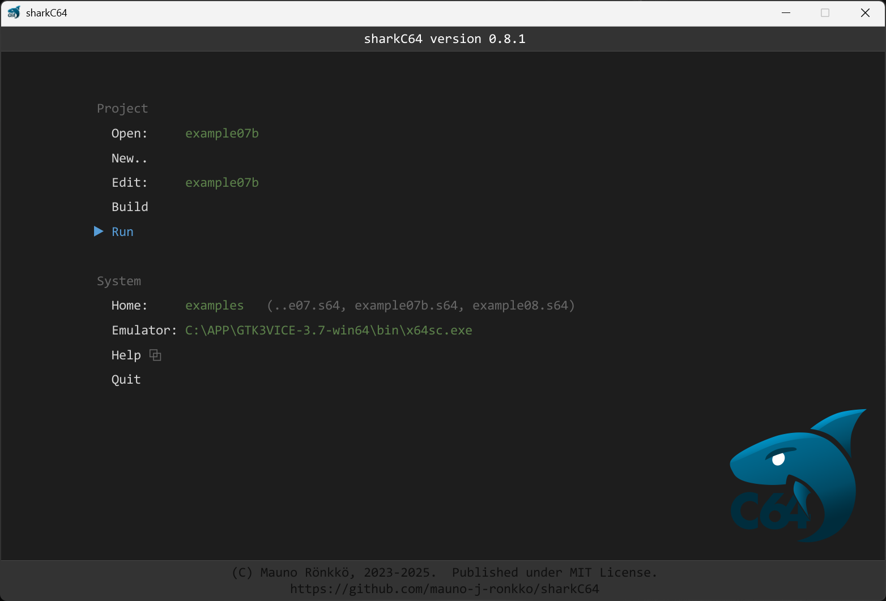

# Running the project

The home screen of the sharkC64 IDE looks as follows:

To run the project, click the Run action in the project section.
If the project has not been built yet, the Run action will first build it
and then run it. 

The Run action uses the Emulator command for running the built prg file.
If the Emulator command is not supplied, the Run action is not active. 
To read more about the Emulator command, see the text about the [emulator](setting-emulator)
command.

If errors are found during the building phase, the editor view will be opened
and the first error location will be displayed. For more about the
editor view, see the documentation about [editing](editing.md).

  
:leftwards_arrow_with_hook: [Back to index](../index.md)

