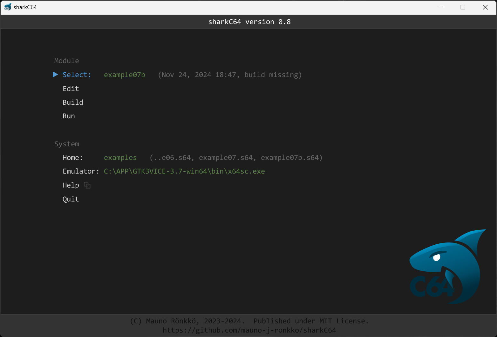

# Selecting an active module

The home screen of sharkC64 looks as follows (captured on version 0.3):

To select an active module, click the Select action in the Module section,
and type the name of the active module. To create a new module, 
type in the name of the new module.

If the module exists, the home screen shows the date when it was last modified.
The home screen shows also the build status of the module (e.g. "build missing").
If the module does not exist yet, the home screen shows "(new)" status next to it.

  
:leftwards_arrow_with_hook: [Back to index](../index.md)

