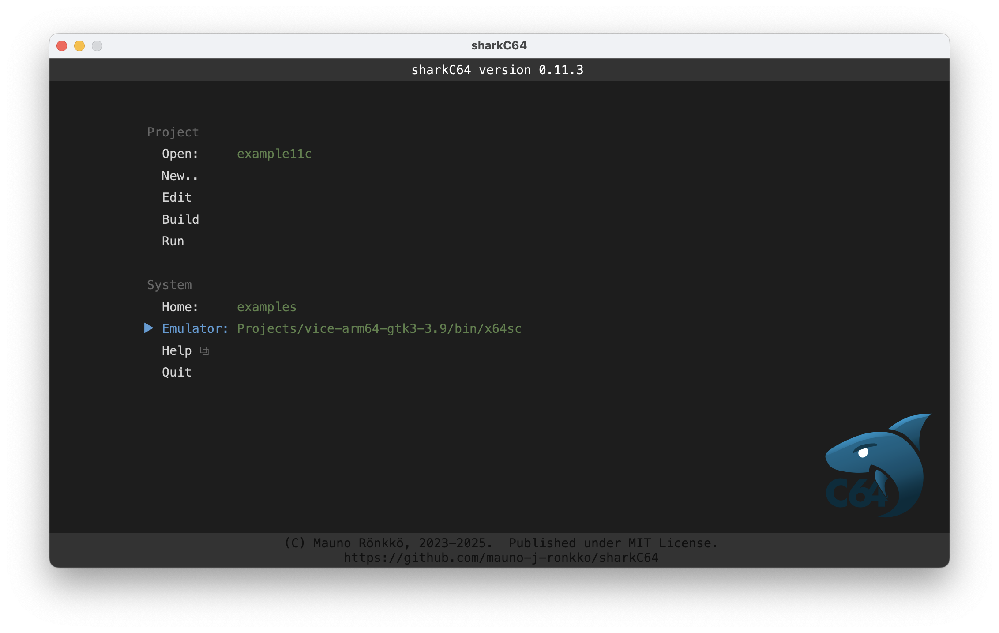

# Setting the emulator command for running a program

The home screen of the sharkC64 IDE looks as follows:

Because the emulator command for running a program depends on your personal system settings
and installations, the sharkC64 IDE leaves it undefined during initialization.
In the picture above, the emulator command for running a program uses the Vice emulator.
In that specific case, the Gtk 3 version of the Vice emulator has been 
installed on a Windows computer to the folder `C:\APP`.

To set the emulator command, click the Emulator action in the System section, 
and type the emulator command. 

The emulator command must refer to some executable file in the system.
If it does not, an "invalid file" status is shown next to it,
and the Run action in the Module section is disabled.

  
:leftwards_arrow_with_hook: [Back to index](../index.md)

