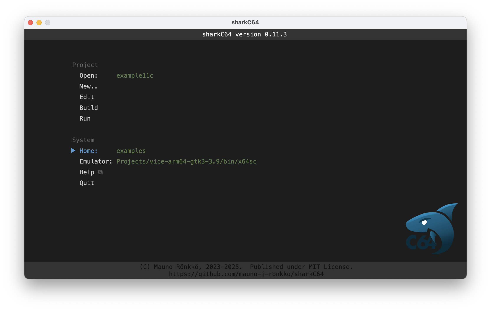

# Setting the home folder

The home screen of the sharkC64 IDE looks as follows (captured on version 0.3):

The sharkC64 IDE initializes the home folder to be the example folder that it creates
when it is started for the first time. To set the home folder, 
click the Home action in the System section, and type the home folder.
To confirm that the folder exists, some of the module file names are listed 
next to the home folder.

Note that the sharkC64 IDE does not create a new home folder.
If the given home folder does not exist, and "invalid folder" status is shown
next to the home folder. Then, all the actions in the module section are also disabled.

  
:leftwards_arrow_with_hook: [Back to index](../index.md)

