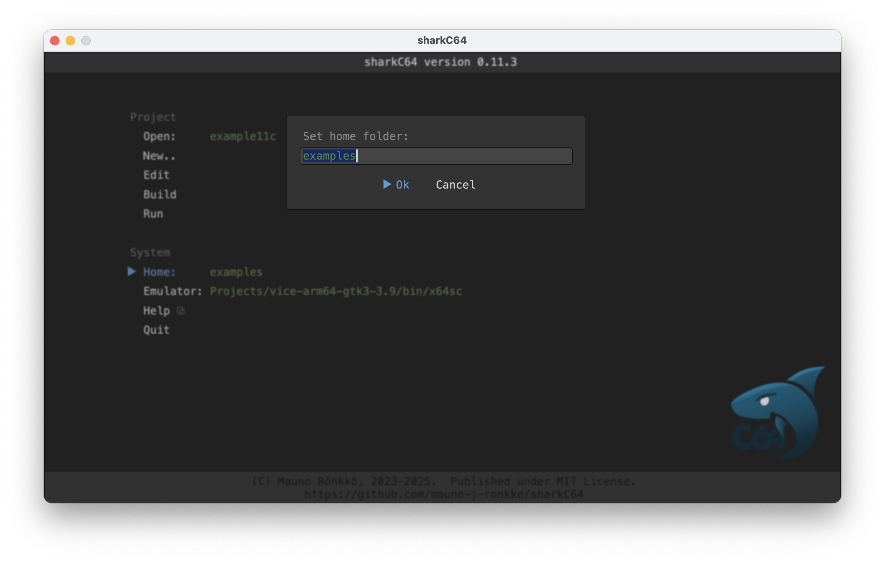

# Setting the home folder

The home screen of the sharkC64 IDE looks as follows:

The sharkC64 IDE initializes the home folder to be the example folder that it creates
when it is started for the first time. To set the home folder, 
click the Home action in the System section.
It will open a dialog asking for the path to the home folder.

If you type the home folder incorrectly, an error dialog is shown.
Note that the sharkC64 IDE does not create a new home folder.
If the given home folder does not exist, an error dialog is shown.

  
:leftwards_arrow_with_hook: [Back to index](../index.md)

