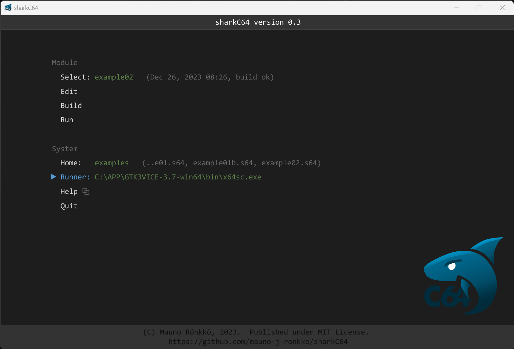

# Setting the runner command

The home screen of the sharkC64 IDE looks as follows (captured on version 0.3):

Because the runner command depends on your personal system settings
and installation, the sharkC64 IDE leaves it undefined during initialization.
In the picture above, the runner command uses a Vice emulator as the runner.
In that specific case, the Gtk 3 version of the Vice emulator has been 
installed on a Windows computer to the folder `C:\APP`.

To set the runner command, click the Runner action in the System section, 
and type the runner command. 

The runner command must refer to some executable file in the system.
If it does not, an "invalid file" status is shown next to it,
and the Run action in the Module section is disabled.

  
:leftwards_arrow_with_hook: [Back to index](../index.md)

