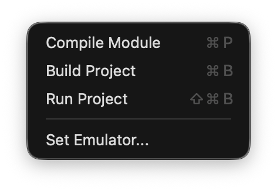
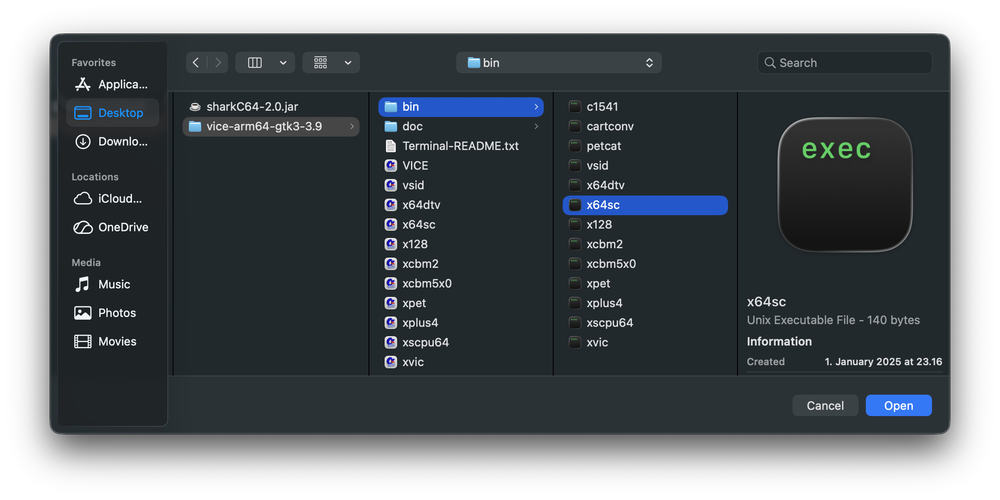

# Setting the emulator for running a program

You can set the emulator from the Compiler menu.

When you select the "Set Emulator" item, it opens a dialog that lets you select the
emulator application. In the example below, the x64sc verison of the Vice emulator
is selected. Note that the appearance of the dialog depends on the operating system.

Once the emulator is chosen, SharkC64 updates the initialization file so that the
emulator is remembered, when the SharkC64 IDE is opened again.

  
:leftwards_arrow_with_hook: [Back to index](../../index.md)

