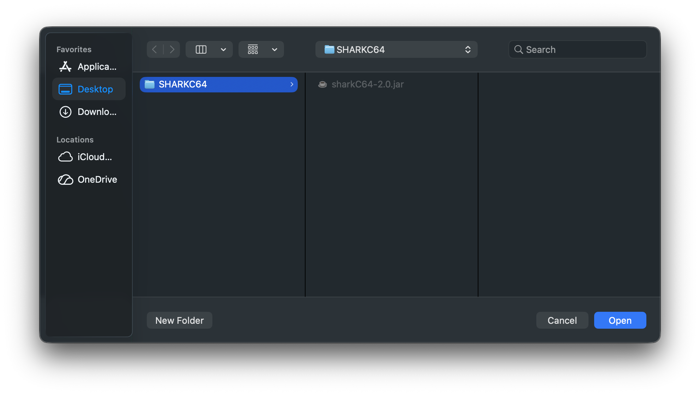

# Setting the home directory

You can change the home directory from the File menu of the sharkC64 IDE.
Note, however, that the home directory can be changed only if there is
no project open.

When you click the "Set Home Directory..." item, it opens a dialog for
selecting the home directory. The dialog's appearance depends on the 
operating system.

When you have selected the new home directory, it is shown in the Project tab in the IDE.

  
:leftwards_arrow_with_hook: [Back to index](../../index.md)

