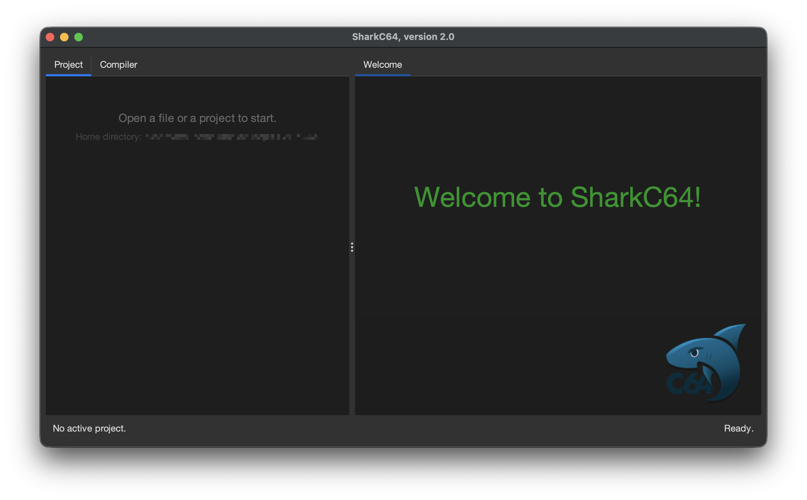

# Starting the SharkC64 IDE 

Instructions to downloading and installing the SharkC64 IDE can be found on a page 
describing [installation](../../prerequisites/installing.md). Before starting the SharkC64 IDE, 
check that you have installed a compatible Java Runtime environment, see [setup](../../prerequisites/setup.md).

The following instructions assume that you have downloaded the SharkC64 jar file.

Here are steps to start SharkC64.
1. Open the folder, where you have downloaded `sharkC64-x.y.jar` file.
2. Double-click the jar file.
   Note that some OS policies may restrict you from executing the jar file without
   granting a permission. This action depends on the OS and its version.
   Also, in some Linux versions, you may then have to click the file with 
   the right mouse button and choose an option to run it.

   **ALTERNATIVELY:** You can open a terminal / command window, change the current directory
   to the folder, where you have the jar file. Start IDE by executing the command
   ```
   java -jar sharkC64-x.y.jar
   ```
3. The integrated development environment for the SharkC64 should open with a greeting.
   


<br /><br />
:leftwards_arrow_with_hook: [Back to index](../../index.md)

