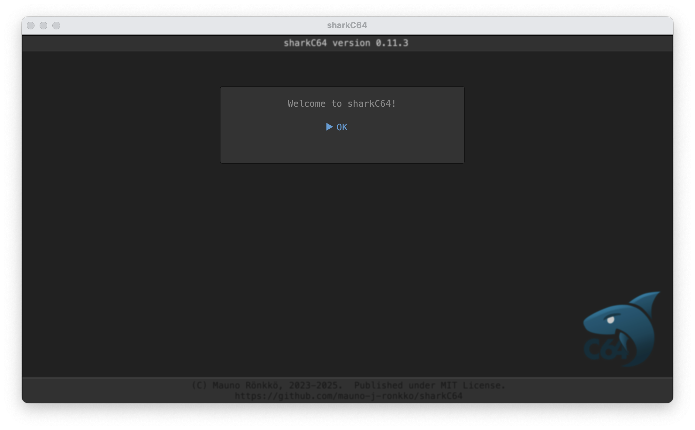

# Starting sharkC64 

Instructions to downloading and installing sharkC64 can be found on a page 
describing [installation](../prerequisites/installing.md). Before starting sharkC64, 
check that you have installed a compatible Java Runtime environment, see [setup](../prerequisites/setup.md).

The following instructions assume that you have downloaded and unzipped sharkC64 in a Windows
computer to the folder `C:\SHARKC64`. You may install sharkC64 to another folder, 
and you may also install it on a Mac or a Linux computer. 
Then, however, you should pay attention to folder paths so that they match the ones that you have.

Here are steps to start sharkC64.
1. Check that you have the following folder structure:
    ```
   C:\SHARKC64
   |
   +-- sharkC64-x.y.z
   |   |
   |   +-- bin
   |   |   |
   |   |   +--sharkC64       // starter script for MacOS
   |   |   +--sharkC64.bat   // starter script for Windows
   |   |
   |   +-- lib
   |   |   |
   |   |   ...
   ```
2. Open the `C:\SHARKC64\sharkC64-x.y.z\bin` folder in FileExplorer in Windows
   (or Finder window on a Mac).
3. Double click `sharkC64.bat` file (or `sharkC64` on a Mac or Linux).
   Note that in some Linux versions, the script file cannot be run by double-clicking it.
   You may then have to click the file with right mouse button and choose an option to run it.
4. The integrated development environment for the sharkC64 should open with a greeting dialog.
   
5. Click the OK button, and you should see the home screen (captured on version 0.3)
   

SharkC64 comes bundled with examples. When you start sharkC64 for the first time, it will
extract the example files to an examples folder and create a file with initial settings. 
Therefore, the folder structure should now look as follows:
```
C:\SHARKC64
|
+-- sharkC64-x.y.z
|   |
|   +-- bin
|   |   |
|   |   +-- examples            // examples folder created by sharkC64
|   |   |   |
|   |   |   +--example01.s64
|   |   |   +--example01b.s64
|   |   |   ...
|   |   |
|   |   +--sharkC64             // starter script for MacOS
|   |   +--sharkC64.bat         // starter script for Windows
|   |   +--sharkC64.ini         // settings for the sharkC64
|   |
|   +-- lib
|   |   |
|   |   ...
   ```

> :warning: &nbsp; The newest version of MacOS may behave differently.
> As a result, the examples folder and the settings file may be created
> directly to your home folder. So, if they do not appear in the
> file structure as shown above, check your home folder.

<br /><br />
:leftwards_arrow_with_hook: [Back to index](../index.md)

