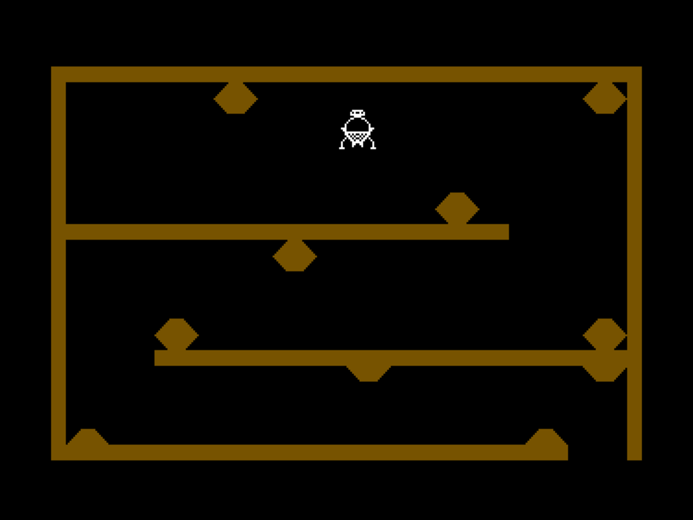
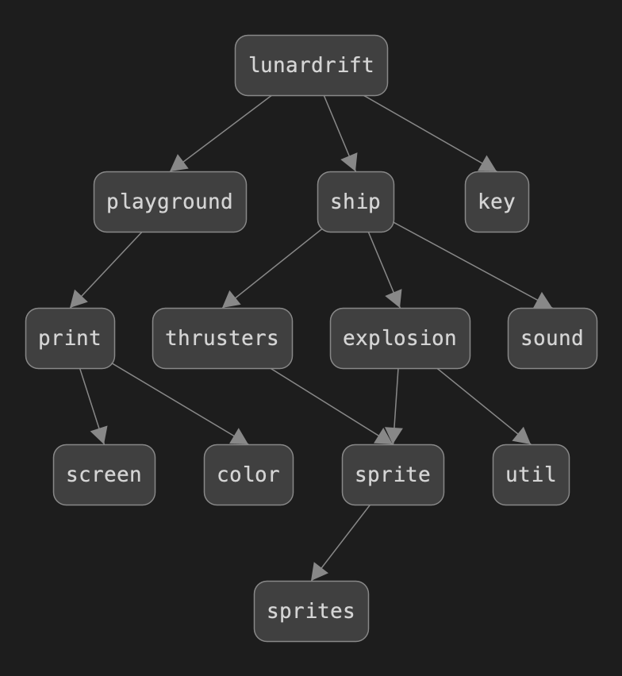

# Lunar Drift

Lunar Drift is a classic moon lander game for the Commodore 64.
The goal is to steer a moon lander module through a cave.
There are three thrusters: left, right, and down.
The thrusters are activated by pressing 'A', 'L', and space bar keys.
The game ends when the lander module hits a wall or it reaches the exit.

This program is provided as a tutorial on how to program with
the sharkC64 language using sprites.
Feel free to experiment with it and develop it further.

The program consists of the following modules:

| Module     | Purpose                                   |
|------------|-------------------------------------------|
| color      | Color constants                           |
| explosion  | Explosion animation                       |
| key        | Key press reader                          |
| lunardift  | The main module for the game              |
| playground | Playground drawing functions              |
| print      | Print functions                           |
| screen     | Screen memory access                      |
| ship       | Functions for moving and drawing the ship |
| sound      | Sound effects                             |
| sprite     | Functions for displaying sprites          |
| sprites    | Sprite images used in the game            |
| thrusters  | Functions for drawing active thrusters    |
| util       | Utility functions                         |

The modules form the following dependency graph:

Published under MIT License  
Copyright (C) Mauno Rönkkö, 2023-2026  
See [GitHub pages for the sharkC64 language](https://github.com/mauno-j-ronkko/sharkC64)