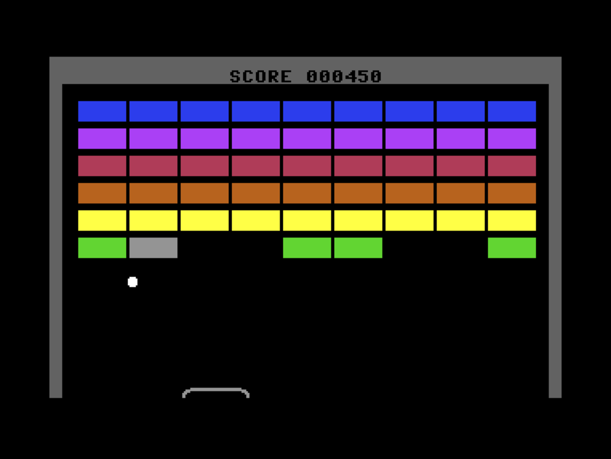

# Pingpong



Pingpong is a classic breakout-like game for the Commodore 64.
The goal is to crash all the tiles with a bouncing ball.
The ball is kept on the playground by moving a bat.
The bat is moved left and right by pressing 'A' and 'L' keys.
The game ends when all tiles are crashed or when the ball
slips out of the playground.

This program is provided as a tutorial on how to program with
the sharkC64 language using multiple modules.
Feel free to experiment with it and develop it further.

The program consists of the following modules:

| Module     | Purpose                                  |
|------------|------------------------------------------|
| ball       | Ball motion animation                    |
| bat        | Bat motion animation                     |
| collision  | Collision state variables                |
| color      | Color constants                          |
| flash      | Tile flash state variables and behaviour |
| key        | Key press reader                         |
| pingpong   | The main module for the game             |
| playground | Playground drawing functions             |
| print      | Print functions                          |
| score      | Score keeping and animation              |
| screen     | Screen memory access                     |
| sound      | Sound effects                            |
| tile       | Single tile drawing and animation        |
| tiles      | Tile management and identification       |


The modules form the following dependency graph:
```
                         pingpong 
                        /   |    \      
                   sound    |     tiles
                            |          \
                +-----------+           \
               / \         / \           \ 
            ball  score  bat  playground  tile
           /    \  \     /  \      \     /    \
  collision      \  \   /   key     \   /      flash
                  \  \ /             \ /     
                   +--+       +-------+
                       \     /               
                        print                
                        /   \ 
                   screen   color
```

Published under MIT License </BR>
Copyright (C) Mauno Rönkkö, 2023-2025 </BR>
See [GitHub pages for the sharkC64 language](https://github.com/mauno-j-ronkko/sharkC64)